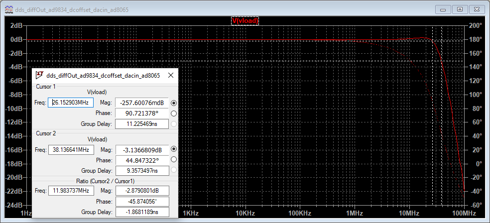

It's been a long time since I've done a pedal simulation, and, well, quarantine times are as good a 
time as any to fill time with LTSpice simulation. Since Radiohead is a too-appropirate soundtrack for 
the time in which we live, and Thom Yorke is a famous user, why not simulate the ProCO RAT distortion 
pedal? 

If you'd like to follow along at home, I've put [the LTSpice file on GitHub](https://github.com/Cushychicken/ltspice-guitar-pedals/tree/master/proco-rat-distortion). Find any errors? Please, submit a pull request!

You may need to rustle up a diode model for the 1N914 to run - it is not one of the models included 
in the LTSpice install. 

# The Whole Enchilada

Here's the whole schematic, labeled for clarity:

The interesting stuff is largely concentrated in the clipping, tone, and output stages.

# Clipping Stage

The clipping stage is formed by a LM308 opamp in a noninverting configuration. 
R2 biases the input at 4.5[V] for maximum dynamic range in the opamp output - i.e., halfway between 
the 9V rail and GND. Feedback gain is set by potentiometer R9. When shorted to 0[ohm], it reduces 
the clipping stage to a simple opamp follower (gain=1). When set to a maximum, gain of the amp in 
signal bands is:

%% Gain = 1 + (Rgain / (560 || 47)) = ~2300 [V/V] = ~67[dB] %% 

This is more than enough gain to drive to the opamp rail for even a gentle input signal. Fed raw into 
a guitar amplifier, this signal would completely saturate the input. That's where the D2/D3 diode clipping 
pair come in to play. (Note, though, that the input saturation is desirable to some users. A common 
modification to this pedal is to remove D2/D3, and rely solely on opamp clipping. This yields a volume 
boost, and crunchier tone.)

The AC coupling network of C10/R10 works to shift the signal back to a DC balanced square wave. D2/D3 serve 
to clip the signal down to a more modest +/-0.65[V]. 

This is slightly more interesting when you move into the frequency domain, however. The net effect, as the 
gain increases, is to emphasize the 1kHz band of the guitar - ideally, to cut through the mix of a band. 
(A rock band, that is - not a frequency band.)

Note that all of these traces converge to the same rolloff asymptote. That's the limitation imposed by the 
LM308's output slew rate. At higher gain, the opamp can't switch any faster, which limits the response of 
higher frequencies as the gain increases.

# Tone Filter

The tone control is remarkably simple - just a first order RC filter, with potentiometer R17 to allow the 
user to set the rolloff frequency. 

R15 and C11 set a limit of the RC filter of the tone stage at about 32kHz. Increasing pot R17 moves that 
corner frequency lower and lower, until bottoming out at 475Hz. This filter effectively smooths the square 
wave into progressively softer edges. As R17 increases, the transitions get less square, and closer to a 
triangular wave. 

This is my estimate of who lies where on the tone curve, based on a subset of [Wikipedia's list of RAT users](https://en.wikipedia.org/wiki/Pro_Co_RAT#Notable_users):

# Output Driver / Volume

The output driver is also relatively simple - just a JFET follower, with a simple RC filter serving as a 
highpass filter for volume control. As R14 decreases in resistance, so does the output volume.

# Putzing Around/Fun Stuff
	* Increasing the compensation capacitor of the LM308 opamp (C1 in our schematic) has some interesting 
    properties. Increasing this to 300pF creates a softer transition to the opamp railing out, which yields an overall softer clip - fewer higher harmonics. An alternative design, for a less harsh clip. 
	* Increasing the compensation cap higher proves problematic - or interesting, depending on your 
    viewpoint. Increasing C1 to 3nF yields a gentle oscillation in the opamp output. This could make for 
    some wacky mixed frequency effects. Might be a fun thing to wire up and see what happens. 
	* Different diodes for D2/D3 could also change the clipping profile, and the harshness of the clip. 

# Acknowledgements

[ElectroSmash](https://www.electrosmash.com/proco-rat), of course, is the vanguard of guitar pedal EE knowhow. I used their page of schematics and simulation output as a sanity check that I got all of this right. 

You can see the slew rate limitation of the LM308 in [the datasheet](https://www.analog.com/media/en/technical-documentation/data-sheets/lt0108.pdf). Gain/bandwidth product is on page 4, under "Open Loop Frequency Response".