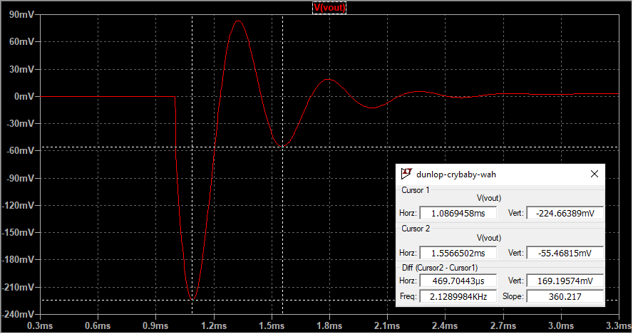
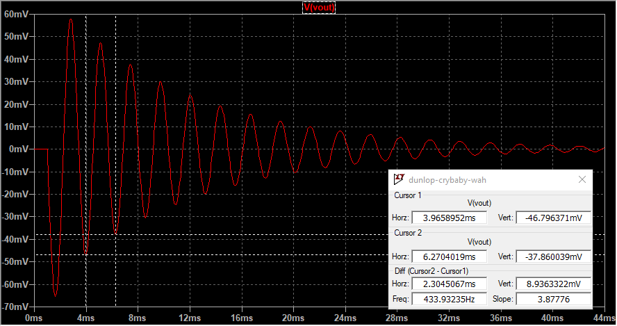
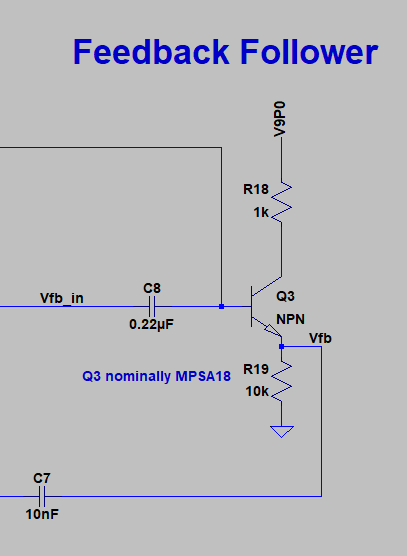
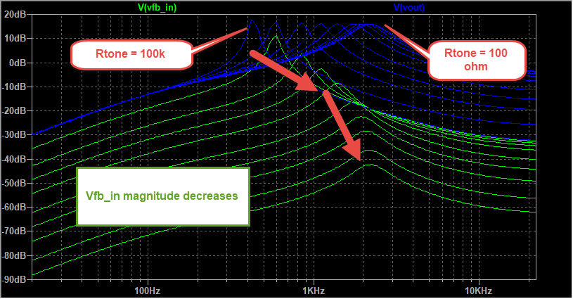
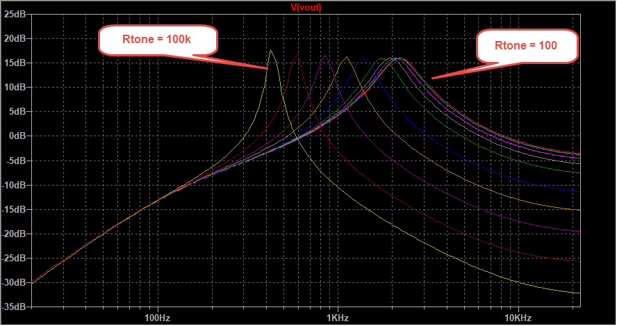

The Dunlop CryBaby is a timeless effect pedal. Jimi Hendrix, Eric Clapton, David Gilmour, and a host of other rock musicians began popularizing the wah effect in the mid 60s, and just about every rock guitarist onwards has toyed with them at one point or another. Seems like a natural choice to look at next using LTSpice. 

If you'd like to follow along at home, [I've put the LTSpice file up on GitHub for your persual](https://github.com/Cushychicken/ltspice-guitar-pedals/tree/master/dunlop-crybaby-wah). Find mistakes? Want to submit mods? Feel free to submit a pull request. 

# The Whole Schematic

This is the first design I've analyzed with no opamps. Cool! Light on active components, but heavy on fun circuit tricks. 

The bulk of the excitement in the Dunlop CryBaby is in the Active Filter + Output section, but we'll take a look at the Input and Feedback Follower segments as well. (Power is very simple - a few bulk caps, and a Zener for reverse voltage clamping in the event that the battery accidentally gets wired backwards. Doesn't meaningfully affect any of the audio stuff we're discussing.)

# Input Buffer 

This isn't anything special - just a high impedance BJT follower. This forms a nice, cheap buffer to redrive the input signal into the downstream components. 

Q1 is actually strongly biased. Based on my limited research, this is pretty rare in guitar pedals. Lotsa vendors out there who want to save a few fractions of a cent on a resistor, apparently. That, and the fact that audio electronics is a pretty small community. Lots of designers bouncing from one company to the next, and a reasonable amount of ripping off of other companies' designs. 

At the end of the day, though, lousy biasing isn't that big of a deal. This is just audio. It's not medical equipment, or critical infrastructure. Worst case, the biasing sucks, and someone's pedal dies. 

# Active Filter + Output
Q2 is a standard common-emitter amp. It also provides the bias for Q3, the downstream feedback amplifier, via R11. 

L1 and C11 form a resonant tank. This LC tank circuit accentuates different frequencies based on the setting of the potentiometer (R14 + R12), which alters the feedback into the tank. (More on the Q3 feedback circuit in a minute.)

This affects the damping, and also the resonant frequency, of the resonant tank. It's easiest to see in the time domain; a simple step response shows that for Rtone = 100 ohms, you get a mildly underdamped circuit with a resonance at ~2.1kHz. 

Crank Rtone up to 100kOhm (i.e. short the feedback path to the output), and you get a wildly underdamped circuit with a resonance at ~430Hz. 

# Feedback Follower 

The feedback follower is really just another emitter follower, like the input stage. Unlike the input stage, it's got a potentiometer serving as a variable attenuator at the input. 

Rtone is really controlling two things: 

* how much current is fed back into the LC tank in the active filter stage, and 
* which frequencies are fed back into the LC stage. 

Rtone and C8 form a very simple RC filter which determines which range of frequencies get fed back. When the potentiometer is at 100k, Vfb_in shorts to Vout, and you're feeding the unattenuated signal back into the LC tank, with no meaningful guitar frequencies suppressed:
$$
R12||C8 = (100k\Omega) || (0.22uF) = 7.2[Hz]
$$

Conversely, when the potentiometer starts to short Vfb_in to GND, you're not feeding anything back into the tank. The RC passband moves down, with most current getting shunted to ground instead of thru C8:
$$
R12||C8 = (100 \Omega) || (0.22uF) = 7200[Hz]
$$
You can see this as you plot Vfb_in against Vout for a sweep of Rtone values across frequencies:

Without the feedback component, Q2 is basically just an active highpass filter. The feedback element formed by Rtone, C8, and Q3 is a variable lowpass filter. Mixing this lowpass element with a highpass zero forms a nice _active bandpass filter_. The net effect of this a nice moving central peak in the magnitude response of the Wah pedal, allowing you to accentuate any signals within the 500Hz to 2kHz band:

Plotting phase with this many sweep components is a bit of an eye exam, but it reveals a pretty useful corollary to understanding the Wah at a conceptual level:

Note that the peak of each output magnitude in the plot aligns nicely with the 180deg phase delta of the input. That's not an accident - in fact, that's the crux of what this pedal is doing. The feedback stage is a simple emitter follower. An emitter follower inverts whatever signal it is fed, leaving you with a signal shifted 180 degrees at the output. That shifted signal, in this case, is fed back into the input, through the resonant tank. If you've done any oscillator design, this 180 degree criterion will sound familiar: 

* take a high gain amplifier, 
* offset its output 180 degrees from the input, 
* and feed the output back into the input, 

...and you have an oscillator! That's the same idea behind the CryBaby. It's basically a crude voltage tuned oscillator, but without the near-infinite gain. You're effectively selecting the oscillator tuning frequency by controlling how much current is fed back into the LC tank. 

# Acknowledgements
ElectroSmash, of course, is an excellent reference on all things guitar pedal, and [their wah analysis is no exception](https://www.electrosmash.com/crybaby-gcb-95). 
The timeless R.G. Keen also has [a wondrous overview of wah pedals](http://www.geofex.com/article_folders/wahpedl/wahped.htm#whatwah), consisting of both circuit and qualitative analysis. 

