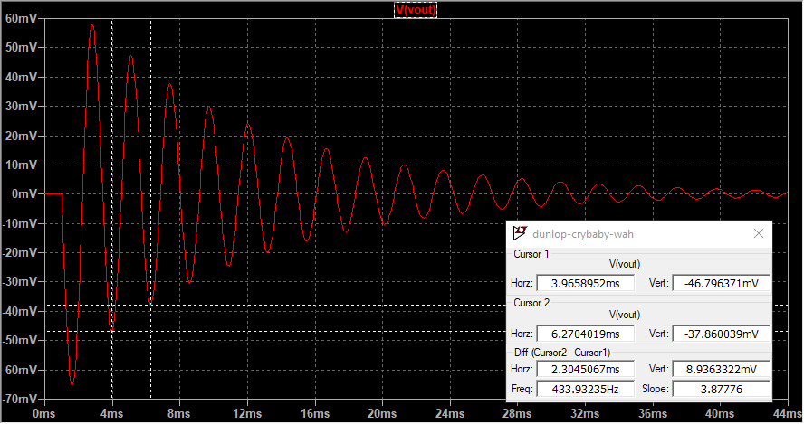
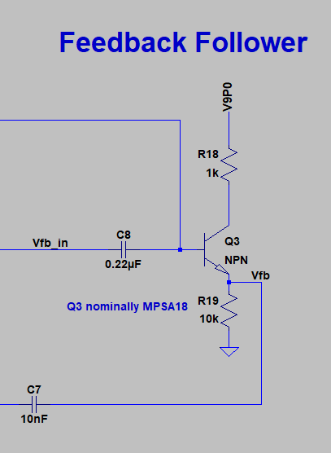

The Dunlop CryBaby is a timeless effect pedal. Jimi Hendrix, Eric Clapton, David Gilmour, and a host of other rock musicians began popularizing the wah effect in the mid 60s, and just about every rock guitarist onwards has toyed with them at one point or another. Seems like a natural choice to look at next using LTSpice. 

If you'd like to follow along at home, [I've put the LTSpice file up on GitHub for your persual](https://github.com/Cushychicken/ltspice-guitar-pedals/tree/master/dunlop-crybaby-wah). Find mistakes? Want to submit mods? Feel free to submit a pull request. 

# The Whole Schematic

This is the first design I've analyzed with no opamps. Cool! Light on active components, but heavy on fun circuit tricks. 

The bulk of the excitement in the Dunlop CryBaby is in the Active Filter + Output section, but we'll take a look at the Input and Feedback Follower segments as well. (Power is very simple - a few bulk caps, and a Zener for reverse voltage clamping in the event that the battery accidentally gets wired backwards. Doesn't meaningfully affect any of the audio stuff we're discussing.)

# Input Buffer 

This isn't anything special - just a high impedance BJT follower. This forms a nice, cheap buffer to redrive the input signal into the downstream components. 

Q1 is actually strongly biased. Based on my limited research, this is pretty rare in guitar pedals. Lotsa vendors out there who want to save a few fractions of a cent on a resistor, apparently. That, and the fact that audio electronics is a pretty small community. Lots of designers bouncing from one company to the next, and a reasonable amount of ripping off of other companies' designs. 

At the end of the day, though, lousy biasing isn't that big of a deal. This is just audio. It's not medical equipment, or critical infrastructure. Worst case, the biasing sucks, and someone's pedal dies. 

# Active Filter + Output
Q2 is a standard common-emitter amp. It also provides the bias for Q3, the downstream feedback amplifier, via R11. 

L1 and C11 form a resonant tank. This LC tank circuit accentuates different frequencies based on the setting of the potentiometer (R14 + R12), which alters the feedback into the tank. (More on the Q3 feedback circuit in a minute.)

This affects the damping, and also the resonant frequency, of the resonant tank. It's easiest to see in the time domain; a simple step response shows that for Rtone = 100 ohms, you get a mildly underdamped circuit with a resonance at ~2.1kHz. 

Crank Rtone up to 100kOhm (i.e. short the feedback path to the output), and you get a wildly underdamped circuit with a resonance at ~430Hz. 

# Feedback Follower 

The feedback follower is really just another emitter follower, like the input stage. Unlike the input stage, it's got a potentiometer serving as a variable attenuator at the input. 

Rtone is really controlling two things: 

* how much current is fed back into the LC tank in the active filter stage, and 
* which frequencies are fed back into the LC stage. 

Rtone and C8 form a very simple RC filter which determines which range of frequencies get fed back. When the potentiometer shorts Vfb_in to Vout , you're feeding the unattenuated signal back into the LC tank:
$$
R12||C8 = (100 ohm) || (0.22uF) = 7200[Hz]
$$

Conversely, when the potentiometer starts to short Vfb_in to GND, you're not feeding anything back into the tank. the RC passband is $R12||C8 = 100 ohm || 0.22uF = 7200Hz$.

