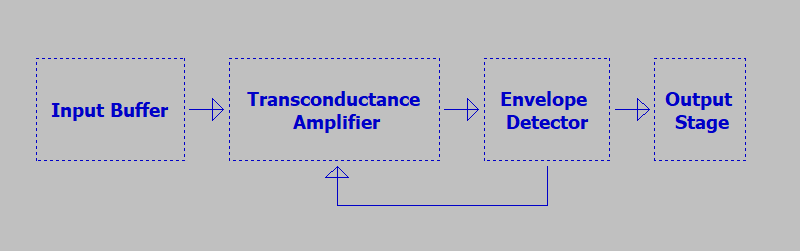
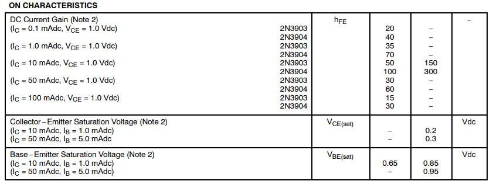
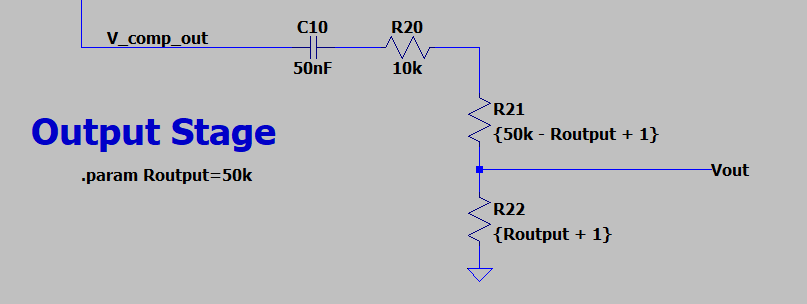

Compressors are another fun audio effect that I've been looking forward to taking a stab at simulating. In the spirit of starting small, I decided to take a look at the MXR Dyna Comp compressor pedal. It's common, it's affordable, and, as compressor circuits go, it's pretty simple to understand. That's saying something, as compression itself is a deep topic - far deeper than can be covered in this one blog post. 

If you haven't had a chance to look at the writeups for other pedals I've analyzed, those are available here:

<ul>
    
    <li>
    	<a href="{{ post.url }}">{{ post.title }}</a>
    </li>
    
</ul>
***Also!*** I'd love to help analyze a particular pedal you're interested in learning about. Got a particular effect you know and love? Send me a schematic and I'll see what I can do. 

# Schematics and Block Diagram

If you'd like to follow along at home, the LTSpice schematic, as per usual, is [up on GitHub](https://github.com/Cushychicken/ltspice-guitar-pedals). I've decided that I'm not going to bother posting a picture of the whole schematic going forward. It saves me a *bunch* of time; after timing it out, I've come to realize it takes an hour or two to optimize the entire schematic to take a good picture for the blog. Frankly, it's not that fun, and doesn't do a whole lot for enhancing my understanding. 

Instead, I've decided it's a little easier and a little faster to do a pretty simple block diagram, and spend more time diving into the interesting blocks. So, without further ado, here's the block diagram for the MXR Dyna Comp:

The Dyna Comp is a relatively simple circuit. We'll spend most of our time examining the input buffer, the transconductance amp, and the envelope detector. 

# Input Stage

The input stage of the Dyna Comp is a nice, familiar circuit: a good old fashioned emitter follower. 

Nothing particularly surprising about its frequency response, either - a nice, flat redrive of the input signal:

R3 is included here and is a fairly common best practice in pedal design, but early models of the Dyna Comp lacked this. That lack of a strong pulldown is cited in some places to explain why the Dyna Comp was occasionally accused of being a "tone sucker".

I'm not sure I buy that diagnosis. I see a more likely explanation in the buffer Q1. Recall that the input impedance of an emitter follower is set by $$r_{in}$$, where:
$$
r_{in} = R_{E}*\beta
$$
You can generally use $$h_{fe}$$ at a given collector current to estimate your transistor's beta. The Dyna Comp used a relatively common transistor (the 2N3904! Yay!) for all of the discrete amplifiers on board. Since this datasheet is easy to find, it's a snap to get these gain values:

With this table, plus a quick deployment of the `.op` SPICE command, we can see that the voltage across the emitter resistor is right at about 1.79[V]. This makes for a collector current of 0.18[mA], meaning our DC current gain is guaranteed to be at least 40[A/A] for the 2N3904. That's good, but as transistors go, it's not *great* - generally, the higher the gain, the better the transistor. This low gain manifests itself most clearly in the input resistance of the emitter follower:
$$
r_{in} = R_{E}*\beta = 10[k\Omega] * 40 = 400[k\Omega]
$$
...and gets worse still when you start to consider the added effect of the bias resistor R5, which, considering the Thevenin equivalent of the input, is in parallel with $$r_{in}$$:
$$
Z_{in} = r_{in}||R_{5} = 285[k\Omega]
$$
This is *really low* for an audio input impedance. Typically, the higher the input impedance, the better. A good rule of thumb is that you want a minimum input impedance of 500 kOhms, just in case you're dealing with an unusually high output impedance driver. 

Funnily enough, the Dyna Comp *also* happens to qualify as one of those high output impedance drivers. We'll dive more into that in a bit.

# Transconductance Amplifier

The original transconductance amp in the Dyna Comp is a Harris/Intersil CA3080. It's called a *transconductance* amp because it relies on voltage inputs, but outputs current. Thus, instead of a typical voltage gain differential amplifier:
$$
V_{out} = A(V_{pos} - V_{neg})
$$
...you instead deal with an output current, and a *transimpedance gain* that governs the ratio of differential voltage to output current:
$$
I_{out} = g_{m}(V_{pos} - V_{neg})
$$

I've substituted the TI LM13700 transconductance amplifier here in lieu of the original CA3080. This is an excellent substitution - in fact, a perfect substitution! [Don Sauer, the lead designer on the LM13700, writes on his website](http://idea2ic.com/LM13600/LM13700.html):

> ...the development spec for the LM13600 was that it needed a schematic to train someone in IC layout. It needed to have 16 pins. And we were going to layout the 3080 anyway. The schematic part was easy. Just used the 3080 exactly.

Fascinating stuff. I've done my fair share of ctrl+V ctrl+C design in my day, so I can't judge for reusing a known quantity. That whole page is worth a read if you're a product development nerd like me!

The DC bias point of the LM13700 is set by the network of R11/R7/R8, plus trim pot R9+R10. The trim pot exists to help correct any imbalances in bias currents between the inputs of the OTA. These bias currents throw off the transconductance characteristics of the amp. The more differently they behave in the input, the less that the amplifier is able to compensate for them through differential operation. Therefore, it's critically important for the single ended impedances of a differential amp to be well matched - so important, in fact, that the die of the LM13700 is laid out symmetrically to facilitate this. ([See this die shot of the LM13700](http://idea2ic.com/LM13600/LM13600Med.jpg) from Don's webpage!) 

*Typically,* however, things are OK inside the die, and there are no serious imperfections requiring a bias correction. As a result, trim pot R9/R10 is left in center position. (Correcting out any bias issues could be done assembly by a technician adjusting the pot value and checking a few specified parameters of the amplifier to be within spec. I'll leave the exercise of determining these imperfections to the reader - I don't have access to a CA3080!)

The C4/C5/R12 network sets the AC termination of the noninverting input of U1. Above 60Hz or so, C5 is functionally a short, terminating the noninverting input in 15k. Beyond 1kHz or so, this rolloff intensifies, as C4 begins to short out R12. 

The net `V_OTA_Gain` deserves some closer examination as well, as this net determines the set point of the OTA's transconductance gain. From the LM13700's datasheet:

Q1/Q2 inside the LM13700 serve as a really simple voltage controlled current mirror. (D1 serves as a simple clamp to help limit the current sunk through Q2 by clamping the max output of Q1.) The turnon voltage of Q1 + Q2 sets the operating voltage of the Amp Bias Input node, pegging it at about 1.3[V]. Using that voltage as a reference, you can sink just about any reasonable input current into the amp bias input node, and you'll have it mirrored in Q2, setting the bias for the input diff amp Q4/Q5 of the OTA chip.  

The net called Amp Bias Input inside the LM13700 is known to us as `V_OTA_GainSet`:

...and it's critical to the operation of the Dyna Comp. We'll go into more detail about why in just a moment. For now, it's enough to say that the R23 is there to set the maximum possible bias current for the LM13700:
$$
I_{bias}= \frac{9.0[V]-1.3[V]}{27[k\Omega]} = 0.28[mA]
$$
Which, in turn, yields a gain of:
$$
g_m = \frac{I_{out}}{V_{in}} = \frac{I_{bias}}{2*(26[mV])} = ~5.4 [mA/mV] 
$$
Where:
$$
V_{in} = (V_{pos} - V_{neg})
$$
Remember: as the bias current *decreases*, so does the LM13700's gain. 

# Envelope Detector

The envelope detector serves to both the drive the signal output of the Dyna Comp, and set the gain of the OTA stage through a feedback loop.  

The common emitter amp built with Q2 functions as a very simple phase splitter. Q2's outputs at the emitter node and collector node are 180 degrees out of phase with one another. Since the emitter and collector resistors of Q2 are equivalent, these signals are the same amplitude, as well. The AC components of these circuits couple into the following stage thru C7/C8, and develop a voltage as the signal current flows into R16/R17. Diodes D1/D2 clamp the signal as it tries to go negative, rectifying the signal to a positive voltage only. 

The conducting point of Q3/Q4 sets the operating point of the whole circuit. When either phase of envelope detector exceeds the turn-on voltage of Q3/Q4, the corresponding transistor starts to conduct, discharging C9. 

For a 1kHz sine wave 100mV amplitude, this stabilizes the current bias at about 16uA, from a starting point of just under 200uA. (Note that the current thru R23 is shown here as negative just in convention. This is current being sunk into the LM13700, and it's decreasing as the circuit continues to operate in this particular test case.)

Net effect on your guitar signal: your output signal quickly goes from overdriven and clipped by the compressor, to slightly boosted:

Compressors exist to manage the *dynamic range* of your guitar's signal. They do this through a pretty simple control loop. (Simple in theory, at least. The Dyna Comp is a very intro-level compressor.) By setting a threshold, and modifying the gain through the effect such that the nominal level of your signal matches the threshold, a compressor "smooths out" variations in volume over time:

The idea behind a compressor is that, in an ideal world, you'd want the signal going into your DAW, or your amplifier, or your mixer, to not get clipped by exceeding the input range of that device, or drowned out in the mix of other audio signals. A compressor serves this purpose by boosting the gain of the signal to make it audible when you're playing quietly, and backing off that gain when your playing volume is too loud. It evens out volume variations!

You can see this more clearly for the Dyna Comp if you run a longer simulation, and change the input amplitude over time. Here's what happens when the Dyna Comp is fed a 1kHz sine wave with an amplitude of 10mV, with a brief amplitude spike to 15mV: 

(**Note:** this is at max sensitivity - pot R19 is set to one ohm.)

You can see pretty clearly how the Dyna Comp *reduces* the gain around the 100ms mark. This is called the "attack" time. It's how fast the compressor pulls back the circuit gain. The simulation shows that, at max sensitivity, the Dyna Comp almost has the output back to the same level as with a 10mV signal. The back end, or "release", of that gain adjustment, is much slower. Vout's amplitude is noticeably lower after the gain adjustment, though the trend of the OTA bias current is trending towards the same setting as before the gain adjustment. Why is that? 

Transistor Q5 controls the bias current feedback path to the OTA. The aggressiveness at which it conducts, however, is set by the voltage across capacitor C9. When Q3/Q4 are off, C9 (along with pullup R18) can be treated as a simple RC circuit with a very slow charge constant:
$$
\tau_{envLevel} = 150 [k\Omega] *10[\mu F] = 1.5 [sec]
$$
As this RC circuit charges, the feedback amplifier transistor will begin to conduct more and more. This gradually increases the gain of the LM13700 over the course of a few hundred milliseconds. You can see this on a longer timescale plot of the compressor's output:

After about half a second at the original amplitude, the compressor gain has effectively stabilized. 

# Output Stage

This is nothing exciting, as output stages go - just a simple pot to control the level. It's not the greatest approach to an output stage. There's no nice low impedance output, especially as you start to dip into the lower reaches of the output pot (as R22 in this image gets smaller, pulling Vout to ground), but it gets the job done. 

# Acknowledgements 

I pulled the compressor schematic from [R.G. Keen's archive on Geofex](http://www.geofex.com/FX_images/dynacomp.gif). I've included the components he indicates there as best practices in this schematic (pulldown resistor R3, for a high impedance input, and bulk caps C1 and C11 for good decoupling of the 9V and 3V bias rails).

For a more thorough overview of compression, I recommend this quick read on [Landr's blog](https://blog.landr.com/how-to-use-a-compressor/). 

I also took a look at the [Electrosmash entry](https://www.electrosmash.com/mxr-dyna-comp-analysis) on the MXR Dyna Comp for some help understanding the bias tees of the CA3080/LM13700. 