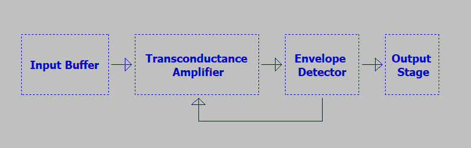
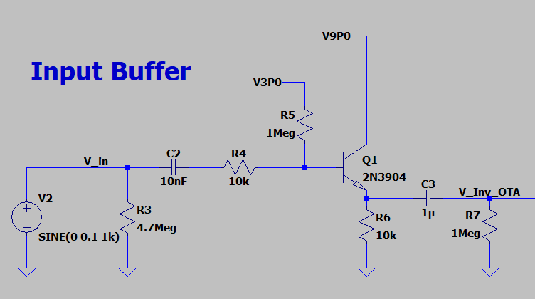
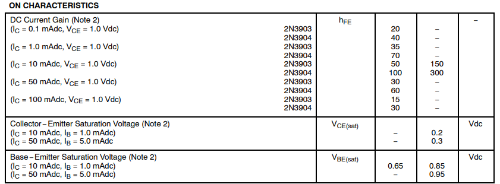
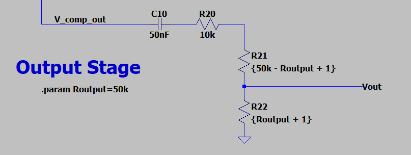

Compressors are another fun audio effect that I've been looking forward to taking a gander at. In the spirit of starting small, I decided to take a look at the MXR Dyna Comp compressor pedal. It's common, it's affordable, and, as compressor circuits go, it's pretty simple to understand. That's saying something, as compression itself is a deep topic - far deeper than can be covered in this one blog post. 

If you haven't had a chance to look at the writeups for other pedals I've analyzed, those are available here:

<ul>
    
    <li>
    	<a href="{{ post.url }}">{{ post.title }}</a>
    </li>
    
</ul>
***Also!*** I'd love to help analyze a particular pedal you're interested in learning about. Got a particular effect you know and love? Send me a schematic and I'll see what I can do. I'd par

# Schematics and Block Diagram

If you'd like to follow along at home, the LTSpice schematic, as per usual, is [up on GitHub](https://github.com/Cushychicken/ltspice-guitar-pedals). I've decided that I'm not going to bother posting a picture of the whole schematic going forward. It saves me a *bunch* of time; after timing it out, I've come to realize it takes an hour or two to optimize the entire schematic to take a good picture for the blog. Frankly, it's not that fun, and doesn't do a whole lot for enhancing my understanding. 

Instead, I've decided it's a little easier and a little faster to do a pretty simple block diagram, and spend more time diving into the interesting blocks. So, without further ado, here's the block diagram for the MXR Dyna Comp:

The Dyna Comp is a relatively simple circuit. We'll spend most of our time examining the input buffer, the transconductance amp, and the envelope detector. Let's check it out! 

# Input Stage

The input stage of the Dyna Comp is a nice, familiar circuit: a good old fashioned emitter follower. R3 is included here and is a fairly common best practice in pedal design, but early models of the Dyna Comp lacked this. That lack of a strong pulldown could explain why the Dyna Comp was occasionally accused of being a "tone sucker".

Realistically, though, the answer is more likely to be found in the buffer Q1. Recall that the input impedance of an emitter follower is set by $$r_{in}$$, where:
$$
r_{in} = R_{E}*\beta
$$
You can generally use $$h_{fe}$$ at a given collector current to estimate your transistor's beta. The Dyna Comp used a relatively common transistor (the 2N3904! Yay!) for all of the discrete amplifiers on board. Since this datasheet is easy to find, it's a snap to get these gain values:

With this table, plus a quick deployment of the `.op` SPICE command, we can see that the voltage across the emitter resistor is right at about 1.79[V]. This makes for a collector current of 0.18[mA], meaning our DC current gain is guaranteed to be at least 40[A/A] for the 2N3904. That's good, but as transistors go, it's not *great* - generally, the higher the gain, the better. This low gain manifests itself most clearly in the input resistance of the emitter follower:
$$
r_{in} = R_{E}*\beta = 10[k\Omega] * 40 = 400[k\Omega]
$$
...and gets worse still when you start to consider the added effect of the bias resistor R5, which, considering the Thevenin equivalent of the input, is in parallel with $$r_{in}$$:
$$
Z_{in} = r_{in}||R_{5} = 285[k\Omega]
$$
This is *really low* for an audio input impedance. Typically, the higher the input impedance, the better. A good rule of thumb is that you want a minimum input impedance of 500 kOhms, just in case you're dealing with an unusually high output impedance driver. 

Funnily enough, the Dyna Comp *also* happens to be one of those high output impedance drivers. We'll dive more into that in a bit.

# Transconductance Amplifier

# Envelope Detector

# Output Stage

This is nothing exciting, as output stages go - just a simple pot to control the level. It's not the greatest approach to an output stage. There's no nice low impedance output, especially as you start to dip into the lower reaches of the output pot (as R22 in this image gets smaller, pulling Vout to ground), but it gets the job done. 

# Acknowledgements 

I pulled the compressor schematic from [R.G. Keen's archive on Geofex](http://www.geofex.com/FX_images/dynacomp.gif). I've included the components he indicates there as best practices in this schematic (pulldown resistor R3, for a high impedance input, and bulk caps C1 and C11 for good decoupling of the 9V and 3V bias rails).