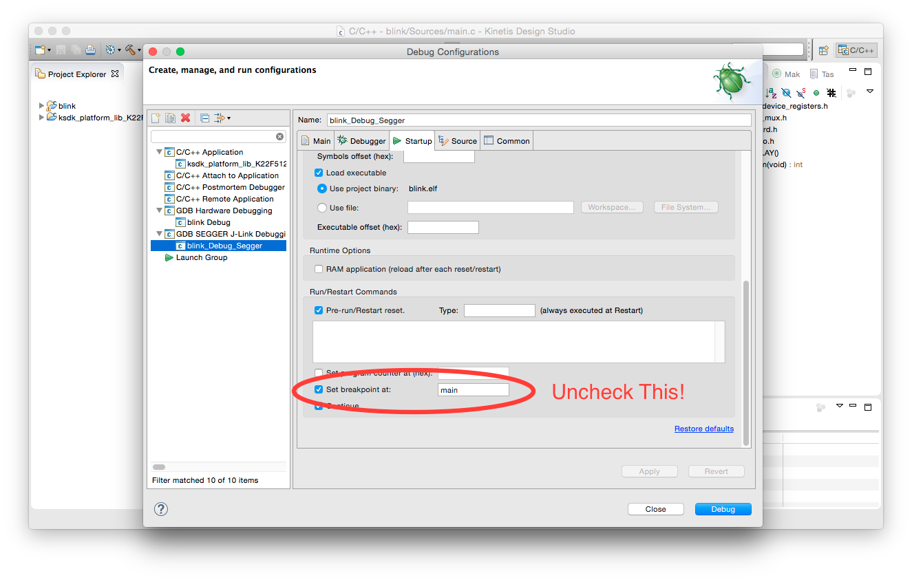

<meta name="description" content="freescale arm cortex microcontrollers"/>
<meta name="description" content="kinetis design suite"/>
<meta name="description" content="segger j-link debugger"/>
<meta name="description" content="flashing without kinetis design suite"/>

I've been doing a bunch of tinkering with Freescale's Kinetis Design Studio platform recently, and one of the issues I've had is trying to figure out how to easily distribute a binary to other folks who need to run it. Most of the Kinetis materials I've found only focus on using KDS as an integrated design studio. It tries hard to be your one stop shop for writing, debugging, downloading, and running code. As a total package, it's great! Decoupling the indivudual functions - the toolchain, the debugger, the programmer - turns out to be a little tricky. This can be frustrating when you want to just email someone a binary with a quick bug fix or update. Wouldn't it be a lot easier for all involved if they don't have to get Kinetis Design Suite up and running just to flash their microcontroller? 

In this article, I want to give a brief overview of how to take a compiled binary in KDS and program a freestanding microcontroller, _without_ KDS's toolchain. 

## What You'll Need
* A working, buildable project in KDS - I would strongly recommend something that toggles the LEDs on your board. 
* A microcontroller board - in this example, I'm using the [Freescale FRDM-K22F](http://www.freescale.com/webapp/sps/site/prod_summary.jsp?code=FRDM-K22F).
* A J-Link debugger - I'm using the [J-Link EDU model](https://www.segger.com/j-link-edu.html).
* [A download of the J-Link Commander software package](https://www.segger.com/j-link-commander.html). Don't worry - it's available for Windows, OS X, and Linux!

## Fixing Your Settings
We'll start at the C/C++ project view of Kinetis Design Studio. Open up the "Run" dropdown menu, and select "Debug Configurations". 

<div align="center">

<p align="center"><em>You Can Find This Menu Under "Run > Debug Configurations"</em></p>
</div>

Highlight whatever debug toolchain you've been using. Click the "Startup" pane in the window to the right. (In my case, it's Segger J-Link, but if you've been using the OpenSDA interface like the ones built into the FRDM series of dev boards, this option will still be present in the "Startup" pane.) Scroll down until you see the option "Insert Breakpoint At" line, and uncheck it. In Debug builds, KDS automatically inserts a breakpoint to allow you to monitor your program's execution, and control when it kicks off. Since we'll be downloading directly to a board, we'll want our program to just run with no external stimulus besides programming completion, so a breakpoint will do us no good. 

At this point, you'll want to rebuild your project without the breakpoint. Just to be on the safe side, I'd recommend cleaning your dependencies first; you can do this by right clicking the project folder and selecting "Clean Project". After that, you can build using Ctrl+B or the "Build" button. This latest file will be available in its usual location: the project tray under the "Debug" folder on the left hand side of the pane. You'll want to find the path location of this file on your computer for the next step; if you can't recall where your project directory is stored, you can just right click the `.hex` file and select "Properties", which will show you the file's full path name. 

## Using J-Link Commander

Segger's hardware debuggers are some of the best in the business, but the commands needed to initiate a programming cycle with their command line tool, J-Link Commander, can be a little opaque. The product help pane is like any Wikipedia page on a math topic - useful, but dense. Let's cut to the chase and get this thing programmed into your device. 

```
> h										// Shorthand for "halt"
> device <device_pn>	
> erase								// Erases on chip flash
> loadfile /path/to/blink.hex		// Initiates programming sequence
> r										// Initiates device reset
```
As soon as you enter the `r` command, your device will be reset by the JTAG link. You should see an LED blinking happily away on your board!