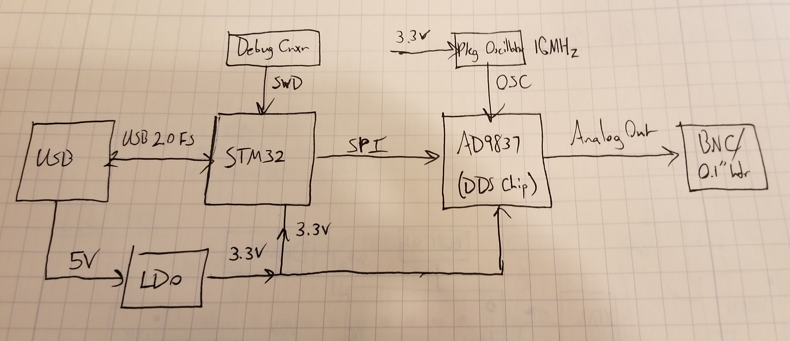
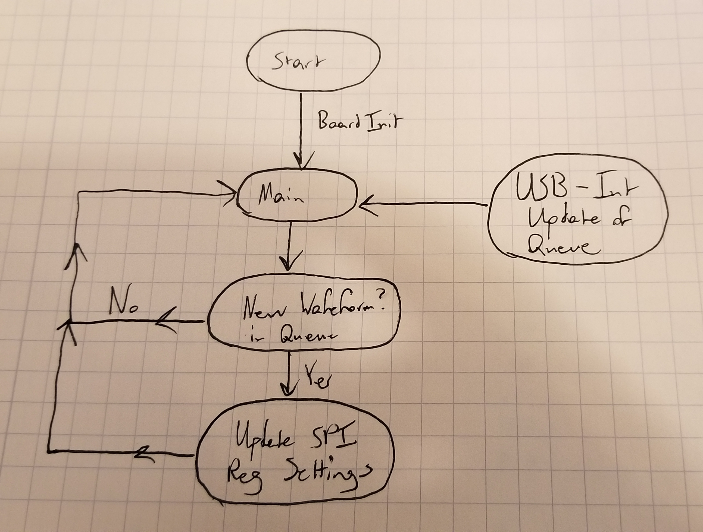
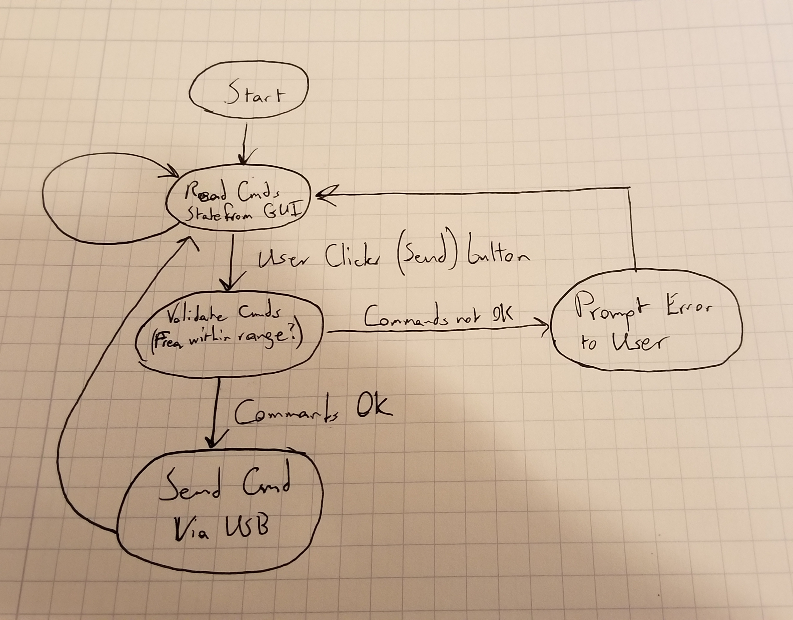

This is my design document for the function generator that I've decided I'm going to prototype, build, and probably end up selling at OSHWA Summit 2020. I'm writing it down mostly to give myself some sort of planning document to refer to when I get deep in the development weeds, and try to remember "Wait - why the fuck am I doing this particular subtask?"

I'm calling this work "bFunc" - short for "breadboard function generator", and also a shoutout to Parliament-Funkadelic. 

Let's put the "funk" back in "function generation".

# Project Requirements

I've lumped together the high-level project requirements here. They're roughly in order of importance, from highest-priority first, to lowest priority later. 

* **All hardware must be open source.** 
  * ...because it's for an *open source* hardware summit. Duh. 
  * All hardware design will be done in KiCAD, so the whole world can see and copy it. 
  * All hardware design files (schematic, PCB layout, BOM, etc.) will be released for free on GitHub or some such similar platform. 
* **The final product must be a function generator.** 
  * The product must generate sine, square, and triangle waveforms. More waveforms are possible, time permitting. 
  * The product must generate all waves with a minimum analog bandwidth of 1MHz. (I don't think there's a ton of hobbyist use above 1MHz, and much beyond 1MHz is getting into the point where it doesn't make sense to be prototyping with a breadboard anyway.)
* **The design must be in breadboard friendly form factor.** 
  * The design must fit into a breadboard using 0.1" headers as mounting hardware.
  * The design must have mounting headers pitched at a convenient distance for a breadboard - i.e. the final product will either straddle the centerline of a breadboard using 0.1" headers on either side of the breadboard centerline, or stretch all the way to the power mounting rails as mounting points. 
* **The project must be ready in time for OSHWA Summit 2020.**
  * I really want to get this completed, and have prototypes in hand to take to OSHWA 2020, ideally so I can sell a few to recoup the cost of materials for the project.  

# Learning Goals 

Here's a list of learning goals for myself. These are my motivating deliverables - i.e. what I hope to take away from this project, 

1. **Learn more about USB.** I don't know hardly anything about the world's most popular consumer data standard, on either the software or hardware sides. This is a nice excuse to learn. 
2. **Learn more about STM32.** [/r/embedded](https://www.reddit.com/r/embedded) (and all the other EE subreddits I subscribe to) has been blowing up over this chipset for years. It's time for me to see what all the fuss is about. 
3. **Build, program, and ship something myself.** I've only ever shipped engineering work in huge teams before. I want to see what happens when I take all of the organizational and logistical guardrails off.
4. **Flex my programming muscles.** I have the itch to write a little more software lately. Something with an embedded and desktop component seems just challenging enough to be interesting without being endlessly frustrating.
5. **Try selling a tiny little product.** I'm terrified of trying to sell something. I want to break that. Having a few pieces of hardware to bring to OSHWA gives me no excuse. It also forces me to have some skin in the game - I want to be able to sell prototypes, so I'll build at a quantity that forces me to sell a few to recoup my costs. 

# Hardware Design

A rough block diagram for the hardware is as follows: 

## Microcontroller - STM32

Why this MCU? Well, [prototype boards are easy to come by](https://www.amazon.com/initeq-STM32F103C8T6-Minimum-Development-Programmer/dp/B079B95L9Y), and there's no shortage of existing OSHW design resources for it. Built-in USB hardware was another requirement I felt like I needed out of the MCU, and STMicro has a fairly large library of USB example code. I also wanted a chip that would run [the TinyUSB stack](https://github.com/hathach/tinyusb), which I've also considered leveraging for doing all the USB communication on the physical board. 

STMicro also has better documentation than many other manufacturers - way more so than the MCUs I typically deal with at work, anyway. (NXP! Boo! *Hiss!!*)

**Note:** I was originally looking at the Atmel SAMD21 for all of the *exact same reasons* I chose to use the STM32. Why'd I change my mind? See my Learning Goals - I want to learn about STM32 in particular. Plus, I got a little ways down the design road for Atmel, and found that they have basically zero software support for developing on Mac OS X, which is what I run at home. Disqualified!!

## Direct Digital Synthesis IC - AD9837

I could have gone with a beefier, more full-function DDS chip, but after considering the options, I decided to keep it a little simpler (stupid) for the first round out of the gate. The AD9837 is software compatible with its larger cousins (like the AD9833 and AD9834), but integrates a lot of the same functionality on-die:

* There's no dedicated square-wave/comparator output. 
* The 200ohm resistor that other ADI DDS ICs need is integrated on-die. 
* It's a physically smaller chip, which should make it easier to fit into a svelte breadboard package. 

Seems like a good idea to let this stuff be someone else's problem for the time being. 

The AD9837 also has the benefit of having a bunch of freely-available driver code from ADI on the internet. 

## What *doesn't* the hardware do?

I had to cut some design corners, just to keep scope of this project in relative check - I have limited time to devote to this project, and the less I commit to, the less I have to get working before OSHWA. 

1. **Amplitude control.** The biggest tradeoff in this design, in my opinion, is the lack of amplitude control. I nixed this feature because it seemed to snowball design complexity pretty rapidly. I really wanted this to be a HW product that would be totally functional from a single connection to a computer - USB comms and power provided from a single USB Micro B connection. The only way I could see myself feasibly adding amplitude control to the project was to add an opamp stage to increase/decrease voltage gain of the output. That, in turn, would require higher voltage rails to get beyond the 0.6[Vpp] capabilities of the AD9837 output. There's really only two ways to get to higher voltage rails:	

   1. add boost regulation to generate positive and negative rails for an opamp output stage, or 
   2. add in a second power connection for a wall wart that supplies positive and negative DC rails for just the opamp output stage. 

   I definitely didn't want to do #2 - there's something really appealing to me about a single power/data connection. I also decided that #1 was feasible, but was just one thing too many to deal with. Keep it simple, stupid. 

2. **DC offset.** Dropping DC offsetting has basically the same rationale as amplitude control. DC offsets require higher voltage rails to give an opamp output stage enough headroom to adjust the output voltage. I've already decided against that. Maybe next time. 

3. **Arbitrary waveform generation.** Ain't got the memory onboard to do it, or the time to learn about how to do it, in the time I have.  

If I end up selling every single one of these designs, then I have no reason not to start planning a more full-featured followup design with this sort of functionality baked-in. But, until then, I have to plan to keep my design commitments somewhat sane. There's only so many hours in a day I can commit to this beast. 

# Design - Embedded SW

Here's my rough logical flow diagram for the embedded software design: 

I'm pretty sure that this is simple enough to rely on a superloop design. Ideally, USB communications will generate updates to the function generator output via USB interrupts, which can be task-queued for the main loop to service on the next iteration of the master control loop. The main loop can then just make simple updates to the DDS chip via SPI writes. 

I'm really only planning on supporting three types of waveform output from the start: sine, square, and triangle waves. It's not terribly difficult to do some more advanced signals with the AD9837 (FSK modulation and sine pulses spring to mind), but I don't think any of these are critical features to have in a first pass of a function generator. 

I plan on relying mostly on STM32 code-generated init functions to get the USB stack up and running happily. Same for the SPI initialization. Next step after that is to get the SPI firmware playing nicely with the USB code. (Hopefully not too much work!) This is one of the areas I think I'll have trouble with - I generally like to let chip vendor code-gen tools do my peripheral initializations for me, because I'm typically not trying to eke out maximal performance from them. However, I've looked through the STM32 USB examples, and I already know that I'll need to learn a lot more about USB Device software to make this thing tick the way I want it to. 

No fear - it's growth potential!! (At least, that's what I keep telling myself.)

# Design - Desktop SW

This is the piece of this project that I know least about, and I think the one that represents the biggest possible stumbling block for me. Here's my very rough sketch of what I think this will look like: 

Currently planning on using the pyusb library for managing USB communication to the actual board. Also planning on using some kind of Python GUI library for making a very simple graphical window for controlling the system visually. 

Ideally, I'd like to have a GUI that a user can adjust waveform type, waveform frequency, and duty cycle with relative ease. Yeah, I know, GUIs are the worst, and the command line is king, but real talk: I actually like the GUI interface on a lot of hardware debug tools like this. Saleae, for example, has an excellent GUI, and I frequently use it with my touchscreen Windows 10 laptop at work. It's just a lot more convenient than the mouse in certain bench circumstances. Instead of having to figure out where my wireless mouse got lost on my workbench, I can just reach over and punch the "Start Capture" button on my screen. Scroll and cursor measurements also work pretty well on Saleae's GUI. If I can get some sort of decent "virtual knob" going on my project, I'll be very pleased.  

# Conclusion

Comments? Criticisms? Feedback? Email me!