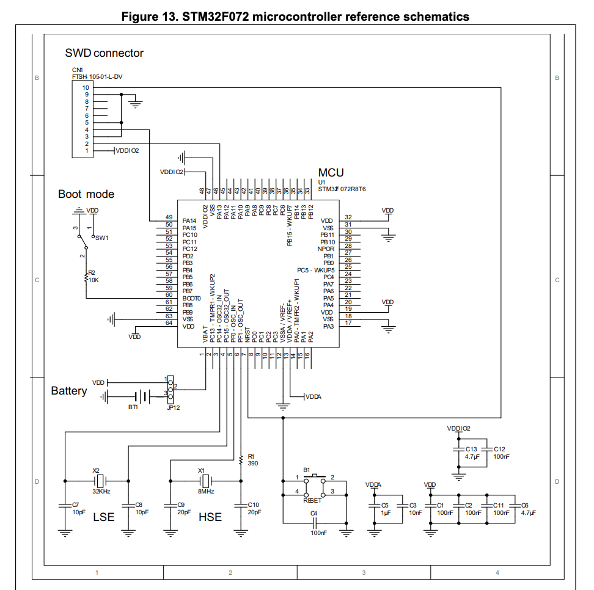
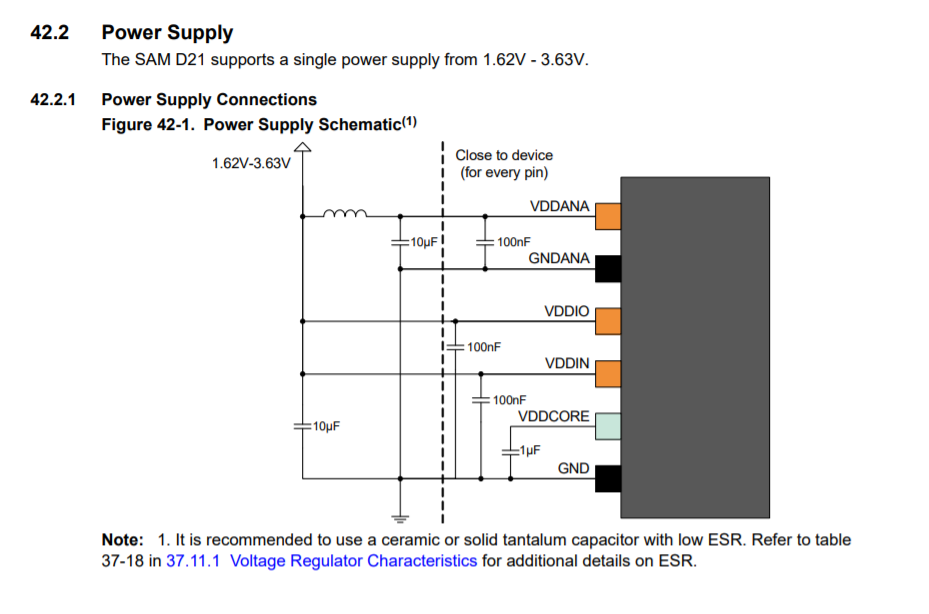

Here's what the first week of development looks like to [build an open source function generator in time for for OSHWA 2020.](http://cushychicken.github.io/insane-oshwa-goals/) Each day's entry represents an hour's work per day - the hour before I leave for my job every morning, to be precise. 

# Feb 7 2020

- Initial placement underway! 
  - Like the cross-association between layout and schematics in KiCAD. 
  - Highlight a component in EESchema, and it will be highlighted/selected in PCBNew
  - Kind of hard to do on my Macbook. I wish I had a second monitor. 
  - Wish there was a way to select a cmpt, then hit a button that was like “Jump to Layout Editor” - I always seem to select a component in EESchema, then click into PCBNew, and find it’s been de-highlighted. 
- Deleted the secondary LDO 
  - Not really using any analog functions of my MCU
  - Could use it as aux power to the DDS, but that’d mean a long power route somewhere that I don't really want to futz with. 
- Starting to think about test point placement
  - [Kerry Scharfglass’s Hackaday video](https://hackaday.com/2019/01/31/down-the-rabbit-hole-of-electronics-manufacturing/) got me thinking about testpoints = fixtures = time saved 
  - Hi Kerry! Thanks for answering my email. 

# Feb 6 2020

- Make LFCSP-10 footprint for AD9837
  - No need! I was searching for the wrong footprint in the default library. Looking for LFCSP-WD package found it. It was already there! And a check in the footprint editor showed the dimensions matched. 
- Finish assigning footprints 
  - This is more nerve-racking than I expected. Constant thought: “What if I fuck one up?” Instant empathy for team of PCB designers at work. 
  - SeikoEpson - your recommended footprint pattern for SG5032 oscillators calls out the *wrong part number! WHY!!!* 
- Find the right footprint for the crystal (not the oscillator)

# Feb 5 2020

- Replaced LDOs with MIC5504 (much cheaper!)
- Added missing power net for 3.3V rail to DDS oscillator
- Assign RefDes’es
  - Done! Easy!
- Make layout floorplan!!
- Assign footprints
  - Wow, this takes a *long* time, and is anxiety ridden. 
- Added breadboard headers for mounting (that’s the whole point of this fucking thing!!)
  - Would make a whole lot more sense if they connected to something though

# Feb 4 2020

- Broke SCH into hierarchical components. Never done a design this way before - we’ll see how this goes! 
- Implemented STM32F072C8T7 Reference Design
  
- ~~Add TVS for USB~~ 
  - I didn’t do this, and may end up regretting it. Note to self - buy a ground strap. 
- Add JTAG connector for MCU! 
  - Done - went with SWD connection. Compatible with ST-Link, or that Segger I have kicking around in my box of random debugger crap.

# Feb 3 2020

- Not a whole lot of sch work, but a lot of questioning my Arch choices. 
- Might STM32 be a better choice? 
  - https://www.st.com/en/microcontrollers-microprocessors/stm32f0x2.html
  - STM32F072C8T7
    - Datasheet https://www.mouser.com/datasheet/2/389/stm32f072c8-956183.pdf
  - Supports Mac toolchain (AVR does not)
  - Familiar debug protocol (SWD)
  - Just about identical pricing ($2.75 for 10)
  - STM32 HW Quickstart Guide (Includes HW Reference Design) - https://www.st.com/content/ccc/resource/technical/document/application_note/c9/19/d7/b8/6b/0e/4c/d3/DM00051986.pdf/files/DM00051986.pdf/jcr:content/translations/en.DM00051986.pdf

# Jan 31 2020

- Make symbol for AD9837
  - This is easy, and pretty intuitive 
  - The symbols are the reverse of what I’m used to (orcad) - bubble is the connection point for the *wire,* not for the symbol box 
  - I like that you can automagically include the datasheet link and part information
  - Also really enjoying the hot keying setup - just hit a button and you bring up a new dialog
  - Also - how do you make the interior of the SCH symbol yellow like everything else? 
- Start reference design of AD9837 
  - Issue number 1: what’s the primary power source of this thing? 
  - Lots of jumper options for selecting power into the device
  - Do I gather from the reference design that the AD9837 is supposed to be powered by its own POL, and everything else has a separate POL? If so, I’ll *definitely* be finding a cheaper LDO. 
  - Packaged oscillators. Convenience = yay! Price = woof. $1.10 per piece. 
- Hierarchical design! 
  - That’s very cool, and a really different design paradigm than I’m used to. 
  - See a lot of advantages to it - easily replicate circuit “chunks” 
  - Is it as easy to do in layout as it is in SCH? Do you get layout rooms by default as well? 

# Jan 30 2020

- Start SCH capture of ATSAMD21 MCU 
  - Use Datasheet Section 42 (SCH Checklist) as guideline for SCH capture
    - Note to MFGs: this is a great way to get HW engineers to use your parts
    - It’s also a shitload cheaper and more scalable than hiring a bunch of FAEs - paper scales, people don’t!
    - Have a step-by-step guide saying “This is how to implement this thing in HW"
    - We’re typically some combination of time-crunched, and lazy
    - Brilliant! 
  - http://ww1.microchip.com/downloads/en/DeviceDoc/SAMD21-Family-DataSheet-DS40001882D.pdf
    
- Need to Find 5.0V -> 3.3V LDO 
  - Added NCV8114ASN330T1G from On Semi (was in KiCAD’s design library)
  - Could probably find something cheaper though 

# Jan 29 2020

Still mostly parts research at this point. 

- ATSAMD21 
  - Only capable of 3.3V IO voltages, so that kind of dictates what everything else must run at. 
- AD9837 
  - Voltage out only - no need for 200 ohm resistor to terminate current driver. 
  - No comparator output - square wave achieved by driving MSB of phase accumulator at the VOUT pin. 