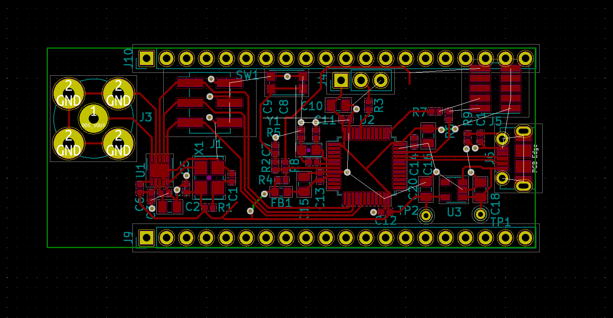

I'm into the second week of development for [the open source function generator I'm trying to prototype and build in time for for OSHWA 2020.](http://cushychicken.github.io/insane-oshwa-goals/) 

Each day's entry represents an hour's work per day - the hour before I leave for my job every morning, to be precise. 

This is my log for the week ending Feb 14, 2020. You can read up on the first week's work [here](http://cushychicken.github.io/bfunc-weekone-log/).

I'd also like to thank Jean Thomas for correcting me in my design document. Jean was kind enough to point out that you *are* able to develop for AVR microcontrollers on Mac. There's even [a handy Homebrew formula](https://github.com/osx-cross/homebrew-avr) to get you started on toolchain setup! However, I'm too far down the STM32 road to stop now, and, well, I was kind of interested in learning more about STM32 from the start. Don't take it too personally I didn't go with AVR, Jean! :)

# Feb 14 2020

- How to confirm that GND vias connect to bottom side plane? *How?! **Answer me!!***
- Quotations coming in
  - PCBWay = $1060, 4 week lead time (big coronavirus delay)
  - CircuitHub = $1706, ships on Feb 28 (built in Massachusetts)
- This is the part where I decide whether I really want to execute on this project or not. It’s about $2k to get these fabbed, which works out to a per-unit cost about 4x what I planned to spend per board. I don’t think anyone will buy one at that price point (about $70).

# Feb 13 2020

- Replaced the debugger connector in layout with 2x5 0.1" through hole connector
  - A little easier to find something in that pinout that will connect to my ST-Link. 
- Much BOM action and uploading to PCBWay
- Coronavirus might be the thing that sinks my timeline. Right now none of the vendors anticipate delivery before March 1, and a delay is more likely than a pulled in schedule.

# Feb 12 2020

- Bottom side ground plane done (you set a ground plane by designating which layer is a power/ground/mixed signal plane in the board configuration. Contextual Electronics videos for the win on this one.)
- Changed out debugger connector to one that I can easily source, and is keyed to ST-Link pinout.

# Feb 11 2020

- A bit of rip-up and re-placement to keep the design in breadboard form factor
- Mostly done!
- Still need to add a GND plane on the bottom layer as a return path
- Still need to add in a different header for debugging (want to connect a ribbon cable from the ST-Link directly)

# Feb 10 2020

- Routing!
- Think it fits in two layers
- Bottom layer is GND
- ...mostly done?
- How to route planes?

# Feb 9 2020

- Toolchain setup successfully completed! Thank god for this page, which I found last night on my phone before going to bed. https://github.com/glegrain/STM32-with-macOS
- Key ingredient - downgrading to STM32CubeMX version 4.26.1. Started out using the latest version of STM32CubeMX, which couldn’t find the target MCU in the part selection pane.
- Worked a treat with arm-none-eabi-gcc as the backend compiler.
- Time to drag out the scope and see if the frequency I’m getting for blinky is right.

**Feb 8 2020**

- I was planning not to work on this project on weekends, but receiving dev hardware is a hard lure to ignore, so I ended up doing a lot of futzing with the STM32 blue pill boards I bought online.
- ST-Link got installed, and talking to the MCU with no problems. I didn’t realize until later that this is an OSSW tool - thanks @texane!
- Lots of futzing, but mostly unsuccessful. Toolchain was the sticking point. Next step is blinking me a LED.  
- Got a few build errors with the makefile - tracked those down to a semihosting issue, which was cleared up with the —specs=nosys.specs option https://stackoverflow.com/questions/19419782/exit-c-text0x18-undefined-reference-to-exit-when-using-arm-none-eabi-gcc