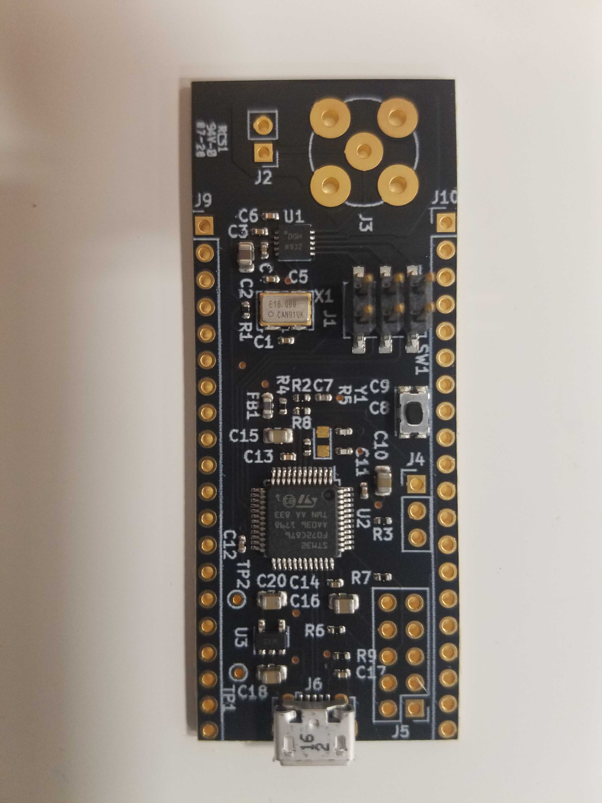

Here's the build log for week three of development for [the open source function generator I'm trying to prototype and build in time for for OSHWA 2020.](http://cushychicken.github.io/insane-oshwa-goals/) 

Each day's entry represents an hour's work per day - the hour before I leave for my job every weekday morning.

This is my log for the week ending Feb 21, 2020. (Well, actually, Feb 22. Make-up workday.) You can read up on the first week's work [here](http://cushychicken.github.io/bfunc-weekone-log/), and the second week's work [here](http://cushychicken.github.io/bfunc-weektwo-log/)

# Feb 22 2020

- Doing a quick hour's work on Saturday morning as a make-up for missing Friday. 
- Working on a nice way to both store the DDS chip state in a single block of memory, and access it. 
- Friend Jason suggested a means of using a struct pointer to access the underlying uint8_t array:

```c
uint8_t data[4];
struct ad9837_ctrl_reg *dds_control = data;
InitCtrlAD9837(dds_control);
```

- I will admit that it's elegant, but also makes me anxious - in no small part because I feel it violates Kernighan's law. (I am definitely not learned enough in C to debug this super effectively.) Additionally, the compiler un-shyly throws a warning here (in typically un-shy compiler fashion):

```powershell
Src/main.c:160:41: warning: initialization of 'struct ad9837_ctrl_reg *' from incompatible pointer type 'uint8_t *' {aka 'unsigned char *'} [-Wincompatible-pointer-types]

 160 |  struct ad9837_ctrl_reg *dds_control = data;
```

- Also kind of wondering if this isn’t overloading the function call a bit. 
  - The dds_control struct is really just a nice way of letting a human understand the bit setting/clearing quickly and easily. 
  - The actual hardware (and the HAL) expects a nice array of uint8_t’s to write out of the peripheral onto the SPI bus.
  - One possible solution - pass a pointer to data to each function (e.g.  StartOutput(uint8_t *data);), and then point to it like it’s a struct of dds_control
  - Allows you to only pass one argument, but still gives you the ability to set/clear bits in a nice human readable way  

# Feb 21 2020

- No progress on code today - had a very human bout of insomnia that I compensated for by shutting off my alarm, sleeping in, and being late to work. (Oops.) 
- Got an email from CircuitHub - boards have been assembled, and are en route! They should be here Monday!! Here’s a picture!!!



# Feb 20 2020

- Added a nice little state machine that just toggles between a sine output and no output. 
- Also wrote a bit of next state logic that can be expanded out into a Mealy machine once we get some more possible inputs. 
- Starting to write a SetWaveformMode() function - going to need to stash another variable here somewhere to store what the current output state is.
  - Need a variable to store that, because we need to know if the DAC is running or not. 
- Created a little struct that’s bit-packed to map to the DDS’s control register.
  - I need to map this into a uint8_t array to write out to SPI now. How do I do that? 
  - It’d be nice to use gdb to examine how the struct is packed so I know how to bit shift it into the single byte SPI char array. 
  - I can `print dds_control` in gdb, and I can `x &dds_control` to see the address, but I don’t know a way to see the underlying bytes that `dds_control` is stored in. 

# Feb 19 2020

- Rewrote the reset/init code of the AD9837
- Instead of a hard-coded 250Hz wave, it now has separate function calls for starting output, stopping output, and setting the Freq0 register value
  - Note: will need to update the Freq0 register settings so as not to overwrite other values in that register
- Will be needing some sort of mild state machine to manage waveforms and switching logic soon. 
- Will also need (or at least would really like) some form of UI so I don’t need to re-flash the board whenever I want to make a dumb code change. 

# Feb 18 2020

- After some twiddling and breadboard setup - *it’s working!* At least, a little bit.
- Used ADI App Note AN-1070 to get a jumpstart on configuring registers for the AD9837. Took a bit of futzing around.
- Originally, I noted that the output frequency was *very* high - way higher than I’d set it. Some digging revealed a set of bits that were reversed. Fixing this cleared things up in a jiffy.
- Still not 100% perfect - I used the App note values, which assumed a 25MHz reference clock instead of the 16MHz I’m using on this Minigen eval kit from Sparkfun. That’s just math, though. Progress!
- Also - this value updates *fast* in the ADC.

# Feb 17 2020

- Technically not working today - I took a long weekend trip to NH to go skiing. No real progress for Monday.
- …though I did get an email from the folks at CircuitHub, who kindly flagged my order as having a faulty hanging net. Whoops. I rerouted the power plane somewhere else, and forgot to clear one of my dangling traces. It shouldn't have a negative effect on the electronics - it's just embarrassing.

# Feb 14 2020 (Later in the Day)

- Said “Fuck it”, whipped out my credit card, and ordered 10 assembled boards from CircuitHub. Total cost: just over $1300.
- I had to compromise on quantity, but I will at least have HW to hand out to a few people at OSHWA. (Not very many pieces, but enough to say I did it, dammit!)
- This turned out to be an excellent decision. At some point over the weekend, I got an email from PCBWay saying that lead times for all PCB and assembly orders was now being pushed out to 60-75 days due to the coronavirus outbreak. Yikes. Coronavirus is already eating up my work life. Now it’s taking aim at my personal projects too! 