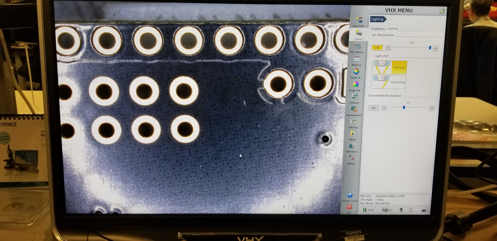
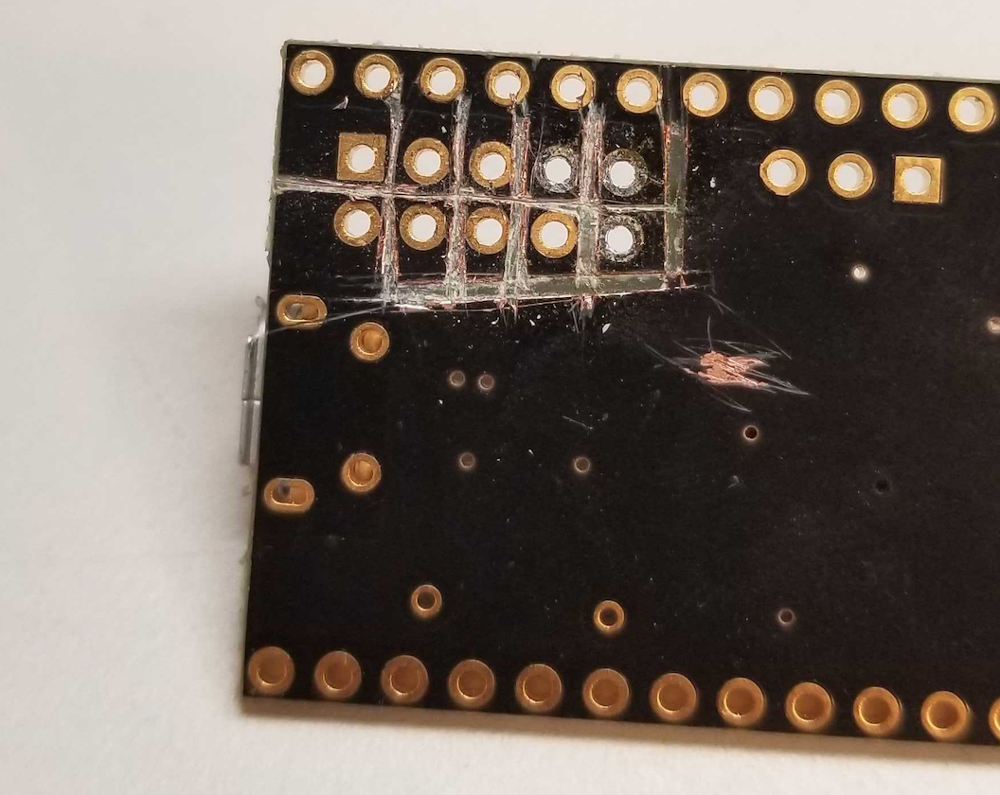

---

bg: "bfunc_proto.jpg"
layout: post
title: "bFunc - Project Journal - Week Four"
summary: "debug, sleeplessness, board errors, life"
tags: ['electronics']
date: 2020-02-29
---

Here's the build log for week four of development for [the open source function generator I'm trying to prototype and build in time for for OSHWA 2020.](http://cushychicken.github.io/insane-oshwa-goals/) 

Each day's entry represents an hour's work per day - the hour before I leave for my job every weekday morning.

This is my log for the week ending Feb 28, 2020. Here's links to the prior weeks' logs:

* [Week One](http://cushychicken.github.io/bfunc-weekone-log/) 
* [Week Two](http://cushychicken.github.io/bfunc-weektwo-log/)
* [Week Three](http://cushychicken.github.io/bfunc-weekthree-log/)

And, if you're really into the philosophy angle, you can read up on [the design doc for this project](http://cushychicken.github.io/bfunc-design-doc/). 

Also - I finally put all of my hardware and software source files on GitHub. [Check 'em out!](https://github.com/Cushychicken/bfunc)

# Feb 28 2020

- After some back-and-forth, CircuitHub has agreed to replace my boards at no cost. Wow!! Very impressed. 
- Working today to evaluate the deltas between the design on my hard drive. I finally got to the point where I was convinced that everything is right, and pulled the trigger on shipping the updated board with CircuitHub. 
  - Highly recommend CircuitHub as a turnkey manufacturer stateside. They're more expensive than China, for sure, but the workflow for reordering design is super slick. 
- I did start looking at a few graphical KiCAD diff tools that show differences between schematics or layouts easily - it highlights diffs that it finds in bright, easy-to-see graphical overlays. It’s a tool I’ve always wanted at work for Orcad (which I’m coming to dislike more, the more I use KiCAD) 

# Feb 27 2020

- Really wanna make this thing work. Very cool tool. Could not get to run on my Mac. https://forum.kicad.info/t/net-aware-pcb-diff-tool-kicad-python-demo/12270/18
- No work otherwise - insomnia won. 

# Feb 26 2020

- You really need to stop making excuses, and start working on the USB portion of this. I demand that you download a reference implementation of USB, and get it running on your BluePill. 
  - Thanks for the nice note, Nash from Yesterday! 
- Started a new directory to just make a vanilla USB CDC device with the Blue Pill. 
  - I selected Communication Device Class because: fuck it, I need to swallow my pride about using a better abstracted serial port. 
  - CDC is the only class of USB I really understand, and as far as I can tell, it suits my needs just fine. 
    - I don’t need synchronous transfers like an Audio Peripheral. 
    - I don’t need mouse/keyboard functionality, so HID is out. 
    - I probably will need firmware updates, but I don’t need them yet - so DFU is on the back burner for now. 
  - OK! First good sign! Building the default HAL settings seems to generate working code, which, in turn, yields a new USB device in my /dev/tty* directory. 
- At this point, I got beset by some sort of wacky programmer error
  - First, the chip failed to respond 
  - A quick GitHub check shows this issue, which might be what I’m seeing: https://github.com/texane/stlink#flash-size-is-detected-as-zero-bytes-size
  - Although, after a few power cycles and resets, I was able to regain SWD communication but I don’t rightly know how
  - Curious if I happened to set some setting wrong in STM32CubeMX - did I maybe select the wrong chip to try and program? 

```powershell
Nashs-MacBook-Pro:usb_cdc_demo nreilly$ st-info --probe

Found 1 stlink programmers
 serial: 343f72063447363360381257
 openocd: "\x34\x3f\x72\x06\x34\x47\x36\x33\x60\x38\x12\x57"
 flash: 0 (pagesize: 1024)
 sram: 20480
 chipid: 0x0410
 descr: F1 Medium-density device

```

- At this point I ended up spending most of my remaining time trying to figure out how to get the chip to respond again
- It appears to talk back now, after some combination of holding down the reset button and using st-util/st-info to get device info via SWD while the chip is held in reset and not executing the program in flash
- Now, however, I’m getting a second cryptic error:

```powershell
Nashs-MacBook-Pro:usb_cdc_demo nreilly$ st-flash write ./build/*.bin 0x08000000

st-flash 1.5.1
2020-02-26T06:21:40 INFO common.c: Loading device parameters....
2020-02-26T06:21:40 INFO common.c: Device connected is: F1 Medium-density device, id 0x20036410
2020-02-26T06:21:40 INFO common.c: SRAM size: 0x5000 bytes (20 KiB), Flash: 0x10000 bytes (64 KiB) in pages of 1024 bytes
2020-02-26T06:21:40 INFO common.c: Attempting to write 12680 (0x3188) bytes to stm32 address: 134217728 (0x8000000)
Flash page at addr: 0x08003000 erased
2020-02-26T06:21:40 INFO common.c: Finished erasing 13 pages of 1024 (0x400) bytes
2020-02-26T06:21:40 INFO common.c: Starting Flash write for VL/F0/F3/F1_XL core id
2020-02-26T06:21:40 INFO flash_loader.c: Successfully loaded flash loader in sram
2020-02-26T06:21:44 ERROR flash_loader.c: flash loader run error
2020-02-26T06:21:44 ERROR common.c: stlink_flash_loader_run(0x8000000) failed! == -1
stlink_fwrite_flash() == -1

```


- Both of these symptoms are listed in the st-link GitHub page, but the only one with a quick proposed solution (mass erase, then try to reprogram) does not seem to fix it
- Theories: 
  - I accidentally set some security bit that makes flash inaccessible
  - I overwrote one of my SWD pin lines to now be USB or some other function

# Feb 25 2020

- Hardware
  - First chunk of today is dealing with the shorts/fab error on J5.
    - None of the pins of J5 were routed out on the bottom side of the PCB.
    - As a result, all of the pins of J5 are shorted together, and to the bottom side copper plane.
    - That’s extra problematic - that bottom side copper plane is GND, and the debugger connector has 5V, 3.3V, and connections to the debugger and the reset lines of the bFunc board. 
    - In short: it don’t fuckin’ work. 
  - CircuitHub’s been contacted, and I’ll be furtively swiping usage of a fancy microscope at my real job to take a picture of the fab error.
    - Hard to do with a cell phone. 
    - Mental note: a good microscope is an essential investment for a home lab. 
  - I was able to do some further work at home by downloading my original PCB and SCH uploads from CircuitHub, back to my machine. The first thing I noticed was the fact that the PCB file downloaded from CircuitHub did *not* match the one on my hard drive. It didn’t have the proper voids around J5; it was also missing a few other minor tweaks.
  - I think I’ve pieced together what happened from my memory here: I uploaded a set of SCH/PCB files a few days before ordering on CircuitHub to get a quote for board prices. In the meantime, I kept working on the PCB layout on my personal machine. Then, when I went to order PCBs, I made a stupid and critical error - _I forgot to update the PCB upload on CircuitHub._
    - There’s a special kind of stupid that you feel when you accuse someone else of making _your_ mistake, and that is the kind of stupid I feel right now. 
    - Fingers crossed that nobody at CircuitHub is too upset by my dumb error. (Thanks for your help, Andrew and Robert!) 
  - Deleted the scratch PCB file “bfunc_layout.kicad_pcb”; I opened it while trying to debug this particular issue and found that it was an unused layout scratchpad. Could only cause confusion keeping it around at this point, so I deleted it. 
- Software 
  - Next step in software land: work on triangle wave generation. 
    - Damn - that was easier than expected! 
    - Three cheers for good state machine design! 
  - Square wave is going to be a problem in this eval setup 
    - I used a Sparkfun Minigen board as an AD9837 eval kit. (The real one from ADI was twice the price, and only worked with some SHARC or other ADI digital platform.) 
    - Downside: AD9837 is AC coupled. Don’t think that will play to well with square wave generation. 
  - I appear to be getting two back-to-back calls to SetWaveformMode() when only one will do
    - A minor bug, but a bug nonetheless

# Feb 24 2020

- Lots of great feedback over the weekend on the project journal. Many great suggestions, particularly about trying out C unions to solve my problem of needing two names to point to the same chunk of memory. I think this ended up being the final winner: 

```c
struct ad9837_ctrl_reg {
    int freqreg   : 2;
    int b28       : 1;
    int hlb       : 1;
    int fsel      : 1;
    int psel      : 1;
    int reserved9 : 1;
    int reset     : 1;
    int sleep1    : 1;
    int sleep12   : 1;
    int opbiten   : 1;
    int reserved4 : 1;
    int div2      : 1;
    int reserved2 : 1;
    int mode      : 1;
    int reserved0 : 1;
};

union ad9837_dds_ctrl {
    struct ad9837_ctrl_reg reg;
    uint8_t data[2];
};
```


- I like it because it allows you to manipulate each bit with this nice struct interface, but then pass and transmit the underlying uint8_t data structure to the SPI peripheral when you need it. Who doesn’t love having the right tool for the job? 🙂
- So, this union seems to work right, except for one thing - it’s *backwards*
  - Struct is packed in reverse order - all the bytes that used to transmit as 0x2000 now come out as 0x0004
  - Reversing the order of the bits in struct ad9837_ctrl_reg does the trick! 
  - (Note - the code block above shows the correct order of the bits in the struct declaration.)
- Turns out this abstraction works really nicely for twiddling those same bits when manipulating the frequency register. 
- Added a .gitignore file and removed all of the junk that spits out in the /build/ directory (no reason to upload that to GitHub!)
- Please, god, someone advise me on the right vim configuration to make [this sort of shitty space formatting](https://github.com/Cushychicken/bfunc/blob/00ccd143869896f0cf79eecaf22733dde3b1c5ce/sw_embedded/stm32_cube_bfunc/Src/main.c#L69) go away automagically
- BOARDS ARRIVED! 
- ...and they have problems. 😂
  - The whole debug connector on the bottom side of the PCB is shorted together. All pins short to each other, and then to ground. 😫🤦‍♂️
  - See below for a high grade microscope shot. 



- Here's what an hour with an exacto knife and a stereo microscope will get you (thanks, work!) 

