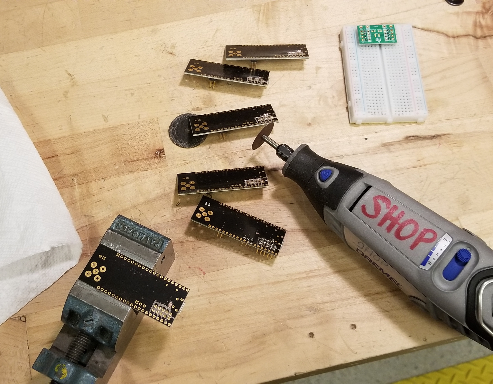

Here's the build log for week six of development for [the open source function generator I'm trying to prototype and build in time for for OSHWA 2020.](http://cushychicken.github.io/insane-oshwa-goals/) At this point, it's clear I won't be delivering this design to OSHWA Summit 2020. However, that's just as much a factor of OSHWA Summit was moved to an all-digital event as it was my level of readiness for it. 

Each day's entry represents an hour's work per day - the hour before I leave for my job every weekday morning.

This is my log for the week ending March 13, 2020. Here's links to the prior weeks' logs:

* [Week One](http://cushychicken.github.io/bfunc-weekone-log/) 
* [Week Two](http://cushychicken.github.io/bfunc-weektwo-log/)
* [Week Three](http://cushychicken.github.io/bfunc-weekthree-log/)
* [Week Four](http://cushychicken.github.io/bfunc-weekfour-log/)
* [Week Five](http://cushychicken.github.io/bfunc-weekfive-log/)

[The design doc for this project](http://cushychicken.github.io/bfunc-design-doc/) is available on my blog if you're into design documents/philosophy. 

All of my hardware and software source files are on GitHub. [Check 'em out!](https://github.com/Cushychicken/bfunc)

# Mar 13 2020

- I took a PTO day for the OSHWA Summit. The summit ended up getting canceled due to coronavirus. (Like most events in the USA these days!) 
- I ended up taking the day to do a bunch of research on the analog output stage of what I’m already referring to as “bFunc Rev 2”. 
- Looking at three main design improvements for the next rev:
  - Eliminating the DC offset of the DDS IC
  - Controlling DC offset programmatically
  - Controlling amplitude programmatically 
- Eliminating the DC offset in the DDS chip 
  - The AD9837 uses an onboard 200 ohm resistor and an onboard current source to generate the DDS voltage output 
  - This has advantages for simplicity, but disadvantages for function generators 
  - In particular: it’s got a DC offset that naturally futzes with function generated output.
  - ADI seems like they have the best means of elminating this annoying offset:
    - Switching to a complementary output DDS chip (e.g. AD9834)
    - Transformer-coupling the output to a 50 ohm or 200 ohm load
- Adding controllable DC offset
  - This seems to be typically achieved with a DAC, a unipolar-to-bipolar conversion stage, and a summing amplifier.
  - [This circuit](http://www.ti.com/lit/an/sbaa343/sbaa343.pdf), from TI's Analog Engineering Cookbook, is particularly interesting. 
  - Lots of great references out there on unipolar-to-bipolar conversion from both [Texas Instruments](http://www.ti.com/lit/ug/slau525/slau525.pdf) and [Maxim Integrated](https://www.maximintegrated.com/en/design/technical-documents/app-notes/5/5581.html). 
- Amplitude control
  - A VGA seems like one way to do this, but they do seem fairly expensive, and somewhat finicky. 
  - Another option - current mode opamp with a digital potentiometer for a gain-setting resistor. 
    - This may risk capacitively overloading the feedback terminal of a current mode opamp. 
    - Digital pots have excess capacitance between their resistor taps - it’s a reasonably well known shortcoming. 
  - This bears more research! 

# Mar 12 2020

- Posted my USB woes on reddit, [got some great feedback from /r/embedded](https://www.reddit.com/r/embedded/comments/fgwbo6/stm32_usb_cdc_question_how_to_tell_which/). 
- The obvious answer, [provided by /u/lordlod](https://www.reddit.com/r/embedded/comments/fgwbo6/stm32_usb_cdc_question_how_to_tell_which/fk7ej8b/), is to set `usb_packet_flag` in the `CDC_Receive_FS()` callback - not in some random other USB interrupt! 
  - This did just the trick - now my `CDC_Receive_FS()` function is happily appending text to my command buffer. 
- Now, for a bit of learning about gdb, and for how to properly send newlines and text prompts. 
  - `gdb` has been a huge asset at this stage. I don’t know much about it but these few commands have done me a world of good:
    - `break main.c:243` - sets a breakpoint at line 243 of `main.c`
    - `continue` or just `c` if you’re into the whole “brevity” thing - let the function run until it hits a breakpoint 
    - `next` or just `n` - run the current line of code, and go to the next line 
    - `disable 2` - disables breakpoint 2. (Each breakpoint is assigned a number when you run the `break` command.)
  - I really need to print out [this handy gdb cheat sheet](https://darkdust.net/files/GDB%20Cheat%20Sheet.pdf) and hang it near my bench. 
  - In any case - I’m setting a breakpoint in my superloop at the point where it processes a command after receiving a `return` keypress. I’m not 100% sure whether the correct return keypress is a newline (`\n`), a carriage return (`\r`), or some combination of those two. (Wikipedia seems to think it could be any of those, based on what kind of system I’m running.)
- Starting to tailor the `SetWaveformMode()` function to stop the DDS output if it’s running, as well as start it if it’s not. 
  - This will require a little DDS state variable - `DDS_Output_Enable` for example.
- Matter of idle consideration: how do I check how much flash and RAM I’m using with my project? I should figure that out at some point. 
  - `arm-none-eabi-size` seems like it has something to do with that, but I’m not 100% sure how to interpret all off that. Guessing I’ll have to go into the STM32F072 memory map. 
  - `arm-none-eabi-size --format=SysV -x build/bfunc_rev1.elf` puts output in a format I can read - now, how do I map this onto the STM32F072's available code space?

# Mar 11 2020

- Managed to get declarations right for `usb_packet_flag` correct, but there’s still junk data getting loaded in and out of the buffer. 
  - I think the IRQ is getting called for packets coming in, as well as packets going out. 
  - Need a way to check the direction of the USB transaction.
  - There is a register field that will allow you to do this: `USB_ISTR` 
  - Trouble is, I don’t know how to access it through the `PCD_HandleTypeDef` 

# Mar 10 2020

- Stuck on progress today because *I left my got-danged boards at work!!*
- More of an R&D morning, then. 
  - First - how would we signal to the superloop that we have new characters incoming from the USB CDC class? 
  - First guess: try `USB_IRQHandler()` in the `Src/stm32f0xx_it.c` file
  - Declare a `volatile extern uint8_t` that lives in `main.c`; use this variable as a flag between IRQ and superloop
  - Set this value to `1` every time the USB IRQ fires 
  - It *may* end up doubling the number of chars stuck into the buffer - I don’t completely understand the reference material but I believe that the USB interrupt may fire both on the INPUT packets and the OUTPUT packets. If that’s the case, I’ll have to add a bit of logic to check which direction the data is headed in when the interrupt fires. 
- Desktop Software Addons
  - Added some extra buttons to set Freq1/Phase1 instead of just Freq0/Phase0

# Mar 9 2020

- An idea for a STM32-side command line parser (from the ancient archives of [AVRFreaks](https://www.avrfreaks.net/comment/705461#comment-705460)) 
  - Used the code sample in Graynomad’s post on this page as an inspiration/starting point 
  - Starting out by implementing a loop like in function `command_handling_loop()`; goal is just to buffer something in MCU memory then print back when ENTER key is pressed 
  - Two issues here:
    - Something about implementing that loop is locking things out in the STM32 - implementing the `switch()` statement line by line is helping to sort out where that lockout is happening 
    - There’s no way to intelligently inform the `while()` loop that new CDC chars are arriving. It’s assuming that the character in `UserRxBufferFS[0]` always needs to be appended to the write buffer 
      - Need some sort of interrupt or flag telling that loop that the character in the buffer is fresh 
  - Also - probably about time to remove the `HAL_Delay()` functions 
- _Also_ need to finish reworking all of my existing boards to hand off to people at OSHWA Summit. (Yeek!) 
- They moved the conference to all-digital. GERD DANGIT.
  - As far as I’m concerned that’s basically a cancelation. 
  - I WANT TO GO MEET OTHER NERDS IRL AND TALK TO THEM ABOUT OUR NERD PROJECTS. 
- I did manage to do a mass-rework of all of my faulty boards with a little help from my good friend The Dremel Tool. Lots of nicely segmented pins now - and with minimal damage to the actual pin plating! (I got pretty good at it by the tenth one.)

# Mar 8 2020

- I know I said “no weekend work” at the outset of this project, but I *_*really_ want to have something semi-complete to hand off at OSHWA summit later this week. (Semi-complete == someone can run `git clone` and, with the proper hardware, feasibly begin using a bFunc board.) Thus, I started work on a very simple Python GUI that will allow a user to select waveform types and frequency settings from a handy GUI interface. 
- (Found some more time later in the day, so I added another label/text box/button to do phase settings as well.)
- Next steps are to add in some serial terminal functionality (I’ll finally have to confront my longstanding fear of the `pyserial` module)
- Also need to finish the command line parser on the board side.
- _Also_ need to finish reworking all of my existing boards to hand off to people at OSHWA Summit. (Yeek!) 