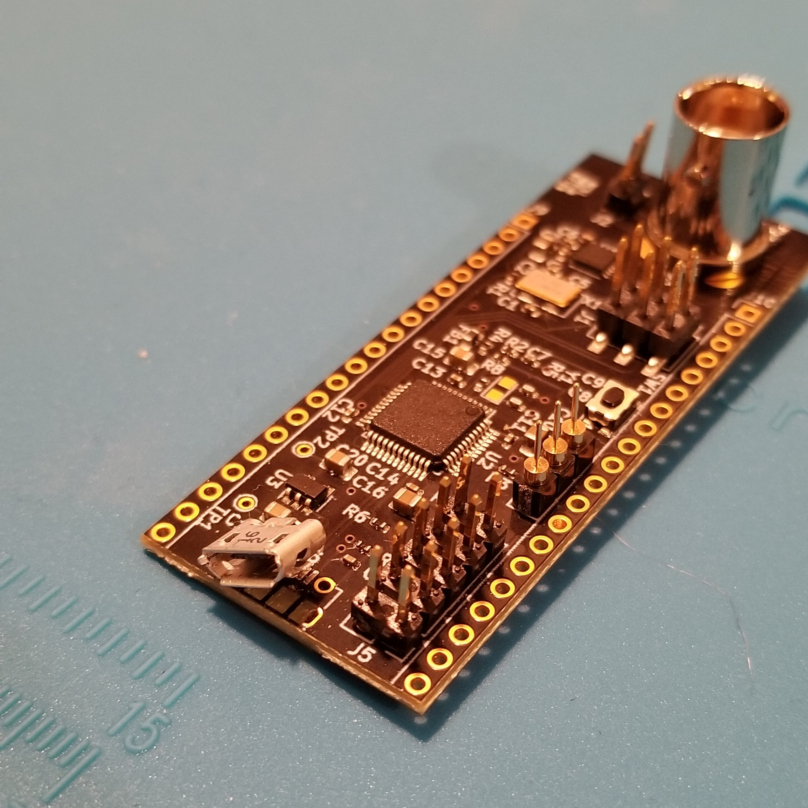

Here's the build log for week eight of development for [the open source function generator I'm trying to prototype and build.](http://cushychicken.github.io/insane-oshwa-goals/) 

**Note:** The prototypes are just about ready for human consumption!! Do you want to try one out? Head over to [this page to get the download.](http://cushychicken.github.io/bfunc-call-for-users/) 

Each day's entry represents an hour's work per day - the hour before I leave for my job every weekday morning. (This is more accurately described now as "the hour before I start working on my _real_ job every day" given the coronavirus lockdown situation.)

This is my log for the week ending March 27, 2020. Here's links to the prior weeks' logs:

* [Week One](http://cushychicken.github.io/bfunc-weekone-log/)
* [Week Two](http://cushychicken.github.io/bfunc-weektwo-log/)
* [Week Three](http://cushychicken.github.io/bfunc-weekthree-log/)
* [Week Four](http://cushychicken.github.io/bfunc-weekfour-log/)
* [Week Five](http://cushychicken.github.io/bfunc-weekfive-log/)
* [Week Six](http://cushychicken.github.io/bfunc-weeksix-log/)
* [Week Seven](http://cushychicken.github.io/bfunc-weekseven-log/)

[The design doc for this project](http://cushychicken.github.io/bfunc-design-doc/) is available if you're into design documents/philosophy. 

All of my hardware and software source files are on GitHub. [Check 'em out!](https://github.com/Cushychicken/bfunc)

# March 27, 2020

- Trying to send a whole line from the desktop app via the serial console is broken
  - Only receiving a single character - the first character of the packet sent, actually
  - Some quick `gdb` inspection shows that the `UserRxBufferFS` string is _not_ being cleared between each read
  - Additionally, the logic is only pulling out the first character of `UserRxBufferFS`
  - That’s fine when you’re a slow human typing one letter at a time - Python’s serial module is much faster than that, however!
  - Added a bit of code to copy `UserRxBufferFS` into `cmd_buffer`, while simultaneously nulling out `UserRxBufferFS`
  - I forgot to initialize the index, for `UserRxBufferFS` at first, but after I did, this seems to work swimmingly! Both for the desktop application, _and_ the direct serial interface!!!
- Work continues on finishing up the desktop application 
  - Plumbing in the functionality behind the Tkinter buttons - setting freq0, freq1, phase0, phase1 with a button press is now possible! 
  - At some point there may need to be a decoupling between the `clicked_waveform` function and the `clicked_phase0`/`clicked_freq0` buttons - those buttons send values to the bFunc board attached every time they are clicked
  - A few more, additional UI notes there
    - Sometimes, it’s useful to disable your function gen’s output, get the settings right, and then enable the output. Other times, you want to just turn the output on, and steer it to the right value by adjusting freq/amplitude/phase to the correct value. Right now, bFunc only works in the second way. 
    - The frequency settings, I’m noticing, are not _quite_ perfect yet. I know this because a 1kHz sine wave does not track perfectly with a 1kHz square wave that the scope outputs for probe calibrations. (I noticed this when trying to use a constant phase reference to test that the phase settings were working properly.) 
      - This is likely due to some corners cut in the `freq0` settings - the bFunc rounds some precision of those numbers off in order to avoid doing division. 
      - Improving the precision of the freq0 register settings _should_ fix this.  

# March 26, 2020

- Much work trying to figure out how to get my Mac to send backspaces properly
  - My Mac will not send backspaces 
  - Briefly thought it was decimal before realizing it was actually _octal_ (bad gdb! Who on earth uses octal anymore?!) 
  - Adding a case statement handles `0x7f` (the DEL key) properly allows you to delete characters
  - Trouble is, it won’t delete them from the prompt, or set your cursor back a space
  - This, I think, gets into a point where I’m dealing with terminal program shortcomings vs embedded code shortcomings
    - PuTTY, on Windows, handles this just fine - character is deleted from the buffer, and the cursor is placed back one space like we expect it to be 
    - `screen` on Mac, does not 
- Also starting to stitch together the desktop application and the embedded terminal
  - Getting the com port variables sorted into the right order and fed to the serial library is no big deal
  - Formatting it correctly and feeding it to the serial port is no big deal either 
  - However, something appears to be getting lost between the python application and the on-device serial terminal
  - The bFunc board is only receiving single characters! The first character sent, in fact. 
  - Am I using the wrong method using `ser.write()`? Should I be using `ser.flush()` instead? 
- Snuck in a little time simulating some work on the next gen output buffer
  - Thinking at this point: definitely switching to a differential output DDS chip
  - With differential current outputs + a properly designed difference amplifier, all DC offsets at the DDS output are eliminated for you!

# March 25, 2020

- Working on finishing up the `SetPhase0Value` functions 
  - Needs a scalar multiplier to get phase in degrees
  - A little pen and paper math reveals 11.38 to be the right conversion factor to get from degrees (which is what the command line interface expects), to radians, which is what the freqreg register needs
- Doing some cleanup now 
  - Deleting unused code - commented out segments that haven’t been used for a while
  - Adding comments on the sections that need them 
- A few comments on the overall codebase:
  - There are no variables tracking overall state of the internal functions
    - There’s no way to get back the current waveform/frequency/phase settings
    - This is a little problematic - puts all the impetus on the user to do that 
    - Working assumption is that the GUI is doing all of that for you
    - However, there are likely going to be people that use this as a command line only application
    - You made all these nice data structres to store state - make some variables for them and use them!
      - `union ad9837_freq_set`
      - `union ad9837_phase_set`
      - `union ad9837_dds_ctrl`
      - Using them likely means figuring out a neat way to refactor `ProcessCommand` to both pass those variables to the function, and return them to the larger superloop.
  - Consider refactoring the repeated `CDC_Transmit_FS()` -> check busy -> attempt retransmit sub-blocks into a single function for readability and brevity. 
  - Command structure at main.c:132 is likely extraneous
    - We’re not actually using that anywhere.
    - A quick comment out/recompile/flash confirms this. 
    - Away it goes! 

# March 24, 2020

- Built up a new testbed after snapping off the USB Micro connector on the old one
  - Trying to figure out a way to position it so that it’s connected to debugger, USB cable, and oscilloscope so that the risk of that happening again is minimal
- Plumbed in a lot of new functionality in the `ProcessCommand()` loop
  - I can now set sine wave, triangle wave, and square wave through the command line!
  - I can also set frequency and phase through the same commands
    - Phase still needs a scalar modifier to get PHASEREG counts updating correctly
    - This is just a pen and paper task of calculating it
  - Still need to write in the Phase command parsing
- Once these last little bits are done, we can start work on the integration between the desktop Python app and the bFunc serial console
  - Hopefully this should be relatively straightforward
  - The Python serial module just has to find the right instance of bFunc, open that serial port, and sending text down to it 
- Time to start thinking about garbage collection in the project
  - Cleaning up commented out code that is unused
  - Giving some attention to the state machine, and giving that state machine some clarity  

# March 23, 2020

- Development’s a little slow this morning - I got a little ham-fisted with my working prototype, and ended up snapping off the USB Micro connector off the PCB.
  - Will need one that’s a little more firmly anchored for the next build!
  - I also have my doubts about this vertical mount BNC connector. The board isn’t really big enough to keep itself upright when a BNC cable is plugged in.
- I’ll need to construct a new testbed
  - This is just soldering a new BNC connector into the board 
  - Also need to tie the GND of the debugger connection into the board GND 
- In the meantime, I guess we’re set to do Desktop Software Features!!
  - Added some radio buttons to select between Waveform output and Modulation output
    - Modulation output is still in development but that’s the next big task once waveform output and the associated command structures are stable!
  - Added a nice feature that grays out and disables the freq1/phase1 buttons when you’re in waveform mode
  - Found this page while googling about Radiobuttons - [it's a real nice Tkinter reference!](http://effbot.org/tkinterbook/button.htm)

# March 22, 2020

- Doing some idle documentation cleanup - both internal and external 
- Internal (i.e. my Evernote notebooks)
  - My documentation finally got their own Evernote notebook! (This is not a big deal to anyone but me. XD )
  - Split out from one giant Evernote note into a few subnotes
  - I now have a nice formatted notebook for each of the following: 
    - Project Journal
    - Desktop Software Backlog
    - Embedded Software Backlog
    - Hardware Improvements for Next Revision
    - Things You’ll Eventually Want to Look At
      - A linkdump/reference notebook
      - Contains a bunch of internet links to topics I think may eventually be useful
      - e.g.: STMicro app notes, USB documentation, analog design articles, python USB notes
      - Planning on publishing this at the end of the project 
    - Prototype Bringup Checklist
      - A list of questions/uncertainties I had around the first prototype bringup
      - Things like voltage sequencing, reset sequencing, clocks starting, etc
- External (i.e. Markdown files and GitHub pages) 
  - The docs got a whole host of updates: 
    - a PDF schematic of the bFunc board
    - an update to the README.md in the top of the project directory
- My new soldering station setup got here! 
  - Now I’ve got a proper soldering iron, an ESD mat, and a little AC timer switch to shut off the soldering iron if I happen to walk away and leave it on. (I do this *a lot* at work, so it makes sense to invest an extra $10 in not burning my house down. I wasn’t able to afford a nice $500 Metcal soldering station that will do this for me, unfortunately.) 
- My BNC connectors got here too!!
  - Soldering station + BNC arrival == let’s solder some stuff! 
  - The new BNCs fit nicely!
  - I did, however, just learn a hard lesson about the USB connectors - they’ll snap right off if you’re not careful. That’s going on the hardware punch list - get a more robust USB-Micro connector!
- This ended up turning this into a bumper crop of Sunday development - features, small and large! 
- Small feature: the DAC output is now turned off when the board is in IDLE state
  - This isn’t the biggest honking deal - it’s just a single bit setting in the control register
  - But it _is_ nice to be able to turn off the DAC and have the output voltage go to zero!
- Small refactor: rewrote the command parsing logic for a little more clarity
  - I rewrote the serial command parsing so that the system tokenizes the input buffer first, then sets commands based on what’s in each field of the command buffer
  - This took about an hour of trying to figure out how I’d borked the logic, before realizing that I had forgot to set an array index variable back to zero. Oops. What memory was I stomping on, I wonder? Clearly nothing important. No hangs, no segfaults, no mysterious bed-shitting.  
- Bigger feature: The system can now take frequency settings from the serial console! Woohoo!
  - Well, it can _sort of_ take frequency settings from the console. 
  - It’s able to _set_ the frequency based on what’s type in the serial console.
  - However, that value needs to get translated into phase accumulator counts. That’s what the DDS IC thinks about: counts. Not Hertz.
  - So, we need a little helper function to translate Hertz into counts.
  - Turns out the answer here is multiplying by 17 - that's approximately the scaling factor needed to convert Hertz to the proper FREQREG setting 
  - NOW we can set frequency from the command line!! 

# March 21, 2020

- Did a little work on the desktop app
- Added the `serial` python library to the app 
- When started, the desktop app now gets a list of com ports available, and then populates a dropdown menu with them
  - This is cool as a first pass
  - Second pass, it would be nice if it could query the USB metadata, and automatically select the one that is a bFunc as the default USB device to control, but still leave the option to the user for which com port to select
  - That needs a little more work on the bFunc side - mostly updating the USB descriptor so that a host computer can identify it 