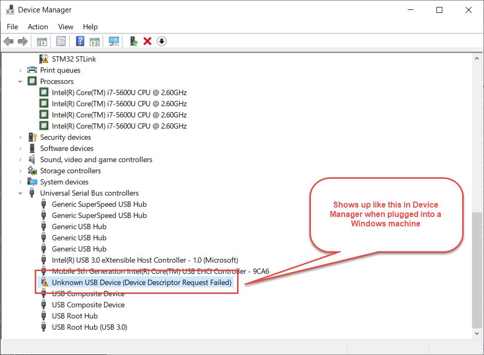

Here's the build log for week ten of development for [the open source function generator I'm trying to prototype and build.](http://cushychicken.github.io/insane-oshwa-goals/) 

Do you want to try one out? Head over to [this page to get the download.](http://cushychicken.github.io/bfunc-call-for-users/) 

Each day's entry represents an hour's work per day - the hour before I leave for my job every weekday morning. (This is more accurately described now as "the hour before I start working on my _real_ job every day" given the coronavirus lockdown situation.)

This is my log for the week ending April 10, 2020. Here's links to the prior weeks' logs:

* [Week One](http://cushychicken.github.io/bfunc-weekone-log/)
* [Week Two](http://cushychicken.github.io/bfunc-weektwo-log/)
* [Week Three](http://cushychicken.github.io/bfunc-weekthree-log/)
* [Week Four](http://cushychicken.github.io/bfunc-weekfour-log/)
* [Week Five](http://cushychicken.github.io/bfunc-weekfive-log/)
* [Week Six](http://cushychicken.github.io/bfunc-weeksix-log/)
* [Week Seven](http://cushychicken.github.io/bfunc-weekseven-log/)
* [Week Eight](http://cushychicken.github.io/bfunc-weekeight-log/)
* [Week Nine](http://cushychicken.github.io/bfunc-weeknine-log/)

[The design doc for this project](http://cushychicken.github.io/bfunc-design-doc/) is available if you're into design documents/philosophy. 

All of my hardware and software source files are on GitHub. [Check 'em out!](https://github.com/Cushychicken/bfunc)

# April 10, 2020

- Starting to dive into DFU boot loader 

  - Watching some training videos: https://www.youtube.com/watch?v=Kx7yWVi8kbU

    - Download/install desktop software 
      - DFuSe (Windows)
      - dfu-util (Linux)
    - Create a .dfu file from a .hex file
      - Included in the Dfuse download
    - Connect STM32 to USB
    - Connect the BOOT0 pin to VDD on the board to enable bootloader
    - Reset the board
    - Choose .dfu file in DfUsE programmer - hit “program"
    - Disconnect BOOT0 from VDD; reset the board
    - New program will be running after board is reset 

  - Following this guide and using Adafruit’s DFU guide seems to work just fine! 

    - https://learn.adafruit.com/adafruit-stm32f405-feather-express/dfu-bootloader-details

    - This is as easy on Mac as using `dfu-util` (install it with Homebrew!) and calling: 

      `dfu-util -a 0 --dfuse-address 0x08000000 -D firmware.bin`

  - I was able to re-flash the firmware on a bFunc board - want to try it with an image that sets some default setting that I can check externally 

    - A blinking LED would be ideal but unfortunately I didn’t include this particular hardware line item on this board. (D’OH!!)

  - Also want to figure out a way to do this entirely from SW. Designing a little external circuit to re-strap the BOOT0 pin sounds fun, but also challenging to perfect, and costs money. A SW reset into a boot loader mode would be ideal! 

    - This is a great description of a reset into the STM32 ROM bootloader: https://stackoverflow.com/a/36793779

# April 9, 2020

- GitHub Issue 
  - John Turner (@whinis) is seeing some sync issues. 
  - These appear to be a consequence of operating at a frequency that is close to the limits of what the bFunc board is capable of providing. 
  - It also appears to be a consequence of a lot of harmonic overtone junk that is making its way out of the signal generator.
  - This looks like a job for - _a 7th order elliptic lowpass filter!!_
- Dammit, my personal eval board decided to stop working!! 
  - I tried plugging it into my Mac this morning to get a reading of the harmonic content, and it won’t appear as a USB endpoint on my Mac. 
  - Does this when I plug it into a Windows machine. 
  - What's going on here?!?!
- Brainwave: maybe it's the timer interrupt 
  - See if disabling the timer interrupt helps - rebuild with `HAL_TIM_Base_Start_IT()` commented out and see if the device is able to enumerate
  - _That_ was the problem - the chip was getting so spammed with timer interrupts that it couldn’t enumerate USB.

# April 8, 2020

- Can we at least start the timer interrupt firing?
  - Turns out - yes!
  - Tried to do this manually, but didn’t have an example to follow. There aren’t any interrupts in the code so far! 
  - So, instead, it’s back to STCubeMX. But even this had some missing pieces. 
  - Turns out I was missing the call to `HAL_TIM_Base_Start_IT()` - now I can see a nice toggling IO! 
  - The timing is a little different than I expected, however. 
  - Originally getting a 50kHz square wave out of the GPIOC_13. Reducing the timer set value by an order of magnitude only doubled the interrupt frequency, instead of increasing it 10x.
  - Guessing that it’s trading off against other routines in the system.
- Next step: generate a 1kHz sawtooth ramp!
  - Use the state transitions from the timer to switch between phase0 and phase1

# April 7, 2020

- Finished the buildID feature! All we needed was a quick `sprintf()` to get integer into hex format for sending along the USB pipe. 
  - I did realize something interesting - there’s a small discrepancy between the build ID reported by `arm-none-eabi-readelf` and the one printed out from the build ID function on board. 
  - It seems like the `arm-none-eabi-readelf` command is missing a zero pad. 
- Cleaned up git caching so that `*.lst` files aren’t tracked by git 
  - This should get me teed up to implement some proper version tracking in line with the Embedded Artistry post I mentioned yesterday. 
  - [This StackOverflow post](https://stackoverflow.com/a/38451183) was most helpful in clearing that up. 
- I got my first bug filed! 
- Now, back to sawtooth waves
  - After a bit of research it seems like the right way to do this is to call `HAL_TIM_Base_Start_IT()` when the sawtooth wave gets started. 
  - A nice first run of this would just be entering sawtooth mode and having it start toggling an LED IO and confirming the correct frequency.
  - Also requires a call to  `HAL_TIM_Base_Stop_IT()` when exiting sawtooth mode.

# April 6, 2020

- Very excited to be heading into Week 10 of bFunc development!
- Started out trying to implement the scheme listed in the Embedded Artistry 
  - This turned into a lot deeper exercise than I anticipated
  - In particular it includes a lot of trying to figure out what all of the `git tag` flags used meant.
  - That, in turn, inspired a bunch of `.gitignore` edits coupled with git cache edits to make sure it removed all of the unnecessary `.lst` files from getting pushed into my git repo from `git tag -a -f -m`.
- After I realized I spent about a half hour doing that, and not writing code, I switched gears implementing the build ID strings as guided by the Memfault blog
  - The makefile and linker script edits went down super smoothly 
  - Converting a uint8_t intto a readable string is apparently something it is too early in the morning for me to reliably execute. 

# April 5, 2020

- Top of mind: code versioning and tracking 

  - Now that I’m sending hardware out to people, and soliciting contributors, I’m gonna need a way to identify what software they’re working with so that bugs can be correlated with a specific code version, and summarily squashed.
  - This isn’t really a problem at the moment - there’s only one firmware version in the field.
  - However, I’m already making modifications to the code in my _own_ repository, and that’s gonna create problems for replication. 
  - Furthermore, I didn’t save off a copy of the binary that I shipped to people. As a result, there’s not necessarily going to be a chance to A/B compare firmware builds. Whoops!
    - Is this really true, though?
    - Isn't there some way to check out a specific git commit and build that version? That might be what I need to do.
  - In any case I’m reading two great blog pieces that inform my thinking on this: 
    - Memfault’s great blog, Interrupt, has [a clear guide for adding GNU build IDs to firmware](https://interrupt.memfault.com/blog/gnu-build-id-for-firmware), and a corresponding mechanism to read them out using your firmware.
    - Memfault also referenced [this great post from Embedded Artistry](https://embeddedartistry.com/blog/2016/12/21/giving-your-firmware-build-a-version/), which details how to add build versions to firmware. I had thought that a build ID and build version info were the same thing, but the EA post added a wealth of detail to my thinking here. 

- More documentation needed:

  - PCB documentation 
    - Pinout and connection guide

  - GUI quickstart
  - Code Contribution Quickstart Guideline
    - How do I guide people to start contributing?
    - Build Instructions
    - Programming Instructions
    - Debugging Instructions