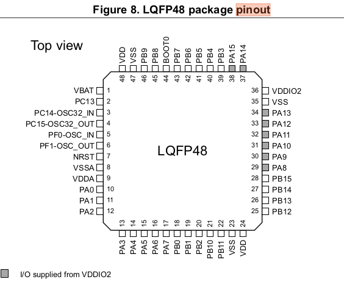

**<u>This Week's Progress:</u>** FSK, PSK, planning for DAC control of an output stage, and FINALLY fixing that damn backspace bug on Linux/Mac!

# May 8, 2020

- How are we going to get DAC output of the STM32F072?

  - Planning on using a DAC to control the DC offset control of the second version. 
  - STM32F072 has two DAC output channels, but they each have only one pin they are able to drive output to, and unfortunately, they are the same pins we selected to use as the SPI interface.
    - DAC_OUT1: PA4
    - DAC_OUT2: PA5
  - Fortunately, the SPI interface can move! But where? 
    - Option 1: Drive SPI1 out of different pins - PB3/PB4/PB5/PA15
    - Option 2: Move control to SPI2 - PB12/PB13/PB14/PB15

- - Option 2 might be better, as it allows for a layout that passes by the DAC outputs. 



- Can we extend our prior PSK work to FSK? 
  - Yeah! It sure seems that way at least. 
  - Most of the logic from PSK extends to FSK as well - it just ends up being Frequency registers that toggle output instead of Phase registers. 
  - The only thing that's tricky here: how does the ISR know which function to call? 
  - It needs to have some knowledge of what state bFunc is in. 
  - Seems like one way to achieve this is to put all of the states declarations into a bFunc header file. That way other files can have access to their data types. 


# May 7, 2020 

- Today's task - initialize a timer for PSK 
  - [This blog post from Vivonomicon](https://vivonomicon.com/2018/05/20/bare-metal-stm32-programming-part-5-timer-peripherals-and-the-system-clock/) has been really helpful for bare-metal initialization of TIM2.
  - It seems to work out of the gate! Inasmuch as the timer interrupt is firing. It only seems to be changing phase channels very, very briefly. Guessing I'm not doing something right in the ISR. 
  - I set up the code to toggle an IO when the TIM2 ISR fires; that shows that we are, indeed, toggling the phase register output very quickly - a fast entry and a fast exit. 
  - Guessing that I'm not clearing an interrupt flag of some sort. 
  - ...and that turns out to be a good guess! Servicing the TIM2 interrupt flag with `TIM2->SR &= ~(TIM_SR_UIF)` did the trick, and set the keying interval properly at ~10 ms.
  - It's not perfect - the symbol interval is actually about 11ms, which suggests that there's either some slack in the keying interval timing, or the multiplication of the timer is wrong. 
  - Either way - not a bad start! 

# May 6, 2020 

- Yesterday we got switching between Frequency registers working 
- Today, it's switching between phase registers. 
- There's now a function, `TogglePhaseReg()`, that swaps between phase register values when the `phasesel` command is called from the command line. 
- Additionally - I FIGURED OUT, AT LONG LAST, HOW TO GET COMMAND BACKSPACING RIGHT.
  - A little help from gdb revealed that Ubuntu, like Mac, actually sends a DEL character instead of a backspace character when the Backspace key is pressed. 
  - For better or worse, I couldn't sleep last night, and I found a useful series of threads on the Microchip forum about handling backspacing on serial consoles. (I can't find a link to those threads now - maybe I dreamed it?)
  - The answer is stupefying in it's simplicity: send a backspace char, then a space, then *another* backspace char back to the host. 
- Added another waveform mode, `MOD_PSK`, to start handling basic phase shift keying symbol generation. 

# May 5, 2020 

- Today's goal: write a function that allows the output to switch between the two frequency registers 
- There's now a `ToggleFreqReg()` function, and a way to swap between freq registers using a serial command (woo!)
- Separately - spent a bunch of time working on streamlining the flow of chip programming on Ubuntu
  - This was mostly reading up on OpenOCD
  - Now we have a one-liner that can program our chips: `openocd -f openocd.cfg -c "program build/bfunc_rev1.elf verify reset exit"`
  - This [Flash programming guide](http://openocd.org/doc-release/html/Flash-Programming.html) was helpful
  - So was [this guide on flash commands](https://jacobmossberg.se/posts/2017/01/10/using-openocd-flash-arm-cortex-m3.html)
  - I wrote both of these up into [a handy setup guide](http://cushychicken.github.io/embedded-openocd-gdb/) that I'm sure I'll need again sometime.  

# May 4, 2020

- Working on setting up the ST toolchain on this new Ubuntu machine.
  - Looks like we're hitting a known issue with ST-Link with concerning regularity:

```powershell
2020-05-04T07:16:38 INFO common.c: Finished erasing 1 pages of 2048 (0x800) bytes
2020-05-04T07:16:38 INFO common.c: Starting Flash write for VL/F0/F3/F1_XL core id
2020-05-04T07:16:38 INFO flash_loader.c: Successfully loaded flash loader in sram
2020-05-04T07:16:38 ERROR flash_loader.c: write error, count == 1023
2020-05-04T07:16:38 ERROR common.c: stlink_flash_loader_run(0x8000800) failed! == -1
```


- - What's the right way to get OpenOCD working on Ubuntu? 

- Some minor fixes to bFunc Rev1 SCH/PCB layout (call it Rev1.1)

  - Missing GND via on DDS CLK oscillator
  - Add testpoints to circuit board:
    - Top side
      - SPI interface
    - Bottom side
      - DDS output for test fixturing