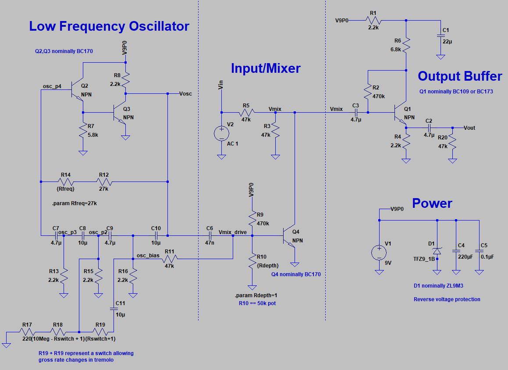
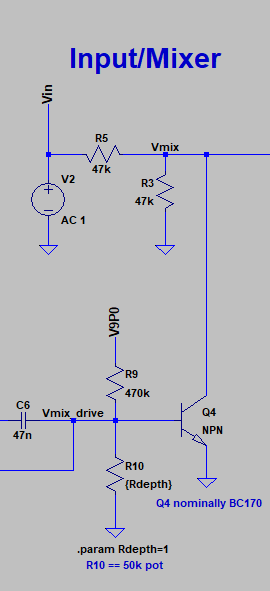
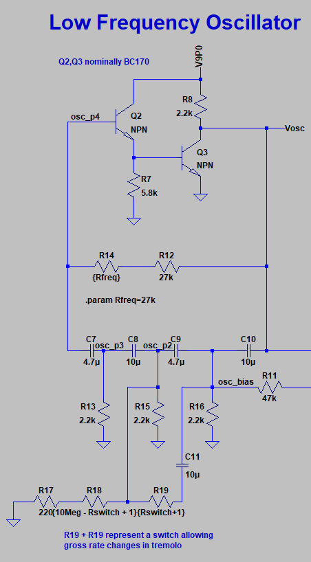
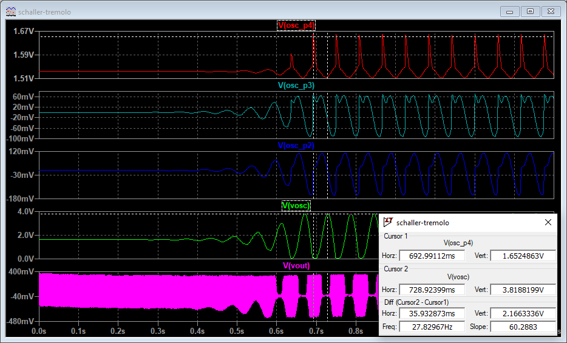
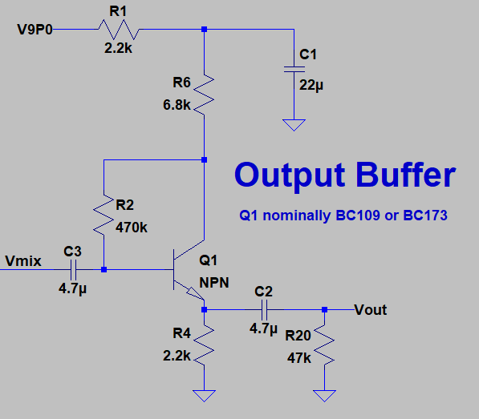
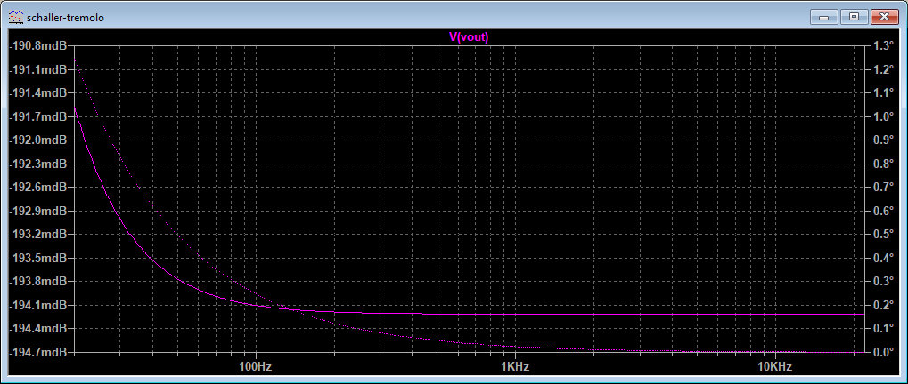

I've been on a roll with these pedal simulations, so, why not keep a good thing going? Today's pedal sim is a closer look at the Schaller Tremolo Pedal. 

Why the Schaller? Apart from the fact that it was convenient to find the schematic, three main reasons:

1. It's vintage - originally released in the mid 60s.
2. It's expensive - used ones retail for over $200.
3. It's *simple* - this is a tremolo circuit you could wire up at home in a few hours.

If you'd like to follow along at home, the LTSpice schematic, as per usual, is [up on GitHub](https://github.com/Cushychicken/ltspice-guitar-pedals). 

_**Note (10/22/2020):**_ If you haven't had a chance to look at the writeups for other pedals I've analyzed, those are available here:

<ul>
    
    <li>
    	<a href="{{ post.url }}">{{ post.title }}</a>
    </li>
    
</ul>

# A Quick Note about Transistors

A quick aside, before we start analyzing why you're paying about $60 per vintage transistor when you buy a Schaller Tremolo Pedal. 

The more astute of you may have noticed that I've gotten lazy on this and the last post. I haven't bothered to associate any specific transistor model to the NPN devices on these schematics. Why not?

### Reason One:  There's nothing special about these BJTs.

There's no magic in the transistors in this circuit. They're just serving as high gain amplifiers, or switches. The precise details of the BJT's characteristics don't matter that much. So long as it's a silicon BJT, the *exact* transistor doesn't make a huge difference in the circuit's operation. You'll get differences of opinion here, and maybe even some real differences as you get into _really_ old pedals and effects that use germanium transistors. (The Dallas Arbiter Fuzz Face is a great example of a pedal where its sound and operation is directly linked to the fact it uses germanium transistors - largely because it's *so simple.*)

### Reason Two: Vintage SPICE models are hard to find. 

Since I brought up "old" - the age component is a big factor of why I haven't gone whole hog on replicating transistor models. Many old transistors don't have readily available SPICE models. Sure, sure, there are parts that have lasted the test of time (looking at you here, 2N3904!) due to widespread use, especially in legacy applications. However, plenty of generic transistor models used in designs like this one were developed, and subsequently made obsolete, before SPICE even existed. 

Ain't nobody got time to find a SPICE model for a component that was obsolete for a decade before I was even born. 

Now, on to the fun stuff!

# The Whole Schematic

There's really only three interesting subsections to the Schaller Tremolo: the input/mixer, the low frequency oscillator, and the output buffer. 

# Input/Mixer

The device input is a nice high impedance, but it immediately chops the input signal down by a minimum of 6dB with the 47k dividers. What gives? R5 is serving as a simple isolator between the input and the Vmix node. That's because Q4 serves as a variable impedance in parallel to R3. It can either be dominated by R3 as Q3 presents a high impedance, or pulling to GND.

Pot R10 sets the bias point of Q4. When R10 == 0, it's basically preventing Q4 from turning on at all. When R10 == 50k, it's biasing Q4 such that its effectively shorting Vmix to GND. This seems kind of dumb, and by itself, it kind of is. It begins to get more interesting once you start looking at what's driving Q4. 

# Low Frequency Oscillator

Q4 is a variable impedance because it's base node, Vmix_drive, is modulated by a really simple low frequency oscillator. 

Vmix_drive is capacitively coupled to Vosc, the output of a low frequency oscillator. Q2/Q3, along with their RC feedback network and the R14/R12 branch, form a _phase shift oscillator_. Phase shift oscillators are, conceptually, very, very simple. They depend on a charging network of RC circuits to offset the turnon/turnoff of a switching element. It's an oscillator, so you want

* Start with a high gain amplifier,
* create a 180 degree phase imbalance between the amp's input and output nodes, and
* Feed the output back into the input

The canonical oscillator example in most introductory electronics courses is a *ring oscillator* - a simple oscillator using an odd number of inverters:

A ring oscillator relies on the propagation delay through the CMOS inverters to create the phase delay between the output and input. The oscillator also relies, in particular, on having an odd number of stages. This gets you the 180 degree phase shift between input and output required to start the oscillations. 

In a phase shift oscillator, you achieve these same two effects through charging RC circuits.  Different method, same effect: the circuit oscillates!

When power is applied, Q3 is off, which allows R8 to pull Vosc up to 9V. This also weakly biases the base of Q2 through R12 and pot R14. As caps C7-C10 charge up, Q2 begins to conduct just a bit more strongly. This eventually causes Q3 to turn on, which creates a discharge path for C7 thru C10. Those caps discharge until the bias on Q2 is gone, and Q3 shuts off, and the whole process starts over again. Thus: oscillation!

This is a pretty miniscule process when power is first applied. The oscillation depends on noise to get started, and takes a few seconds of sim to start switching with any appreciable amplitude. It takes about 2 seconds of sim time to see meaningful switching (greater than half a volt or so) out of the oscillator. You can get a better view of startup if you use multiple panes - allows for different DC offsets to view each switching startup up close. 

Pot R14 sets the bias point of Q2, and as a result, governs the oscillation cycle time of the LFO. A higher resistance between Vosc and osc_p4 means that the oscillator is more dependent on RC charging to toggle the oscillator state. Lower resistance, conversely, means faster oscillations. With the rate switch open, the oscillator rate ranges from about 6.5Hz to 22.6Hz. Closing the rate switch (represented here by R18/R19, and an IF() statement) allows you to further downshift the LFO to an oscillator frequency of about 2.8Hz to 7.8Hz.

# Output Buffer

A pretty meat-and-potatoes current-limited emitter follower rounds out the Schaller Tremolo design:

And, predictably, it has a nice flat frequency response across the whole audio band:

We've seen this kind of buffer a lot, and, just to quickly restate its purpose:

* Present a low impedance output to downstream pedal, and 
* Isolates the modulation transistor Q4 from the downstream signal

...because that's really the core of what this pedal is doing: amplitude modulation! 

Add a few million hertz, a big antenna, and a *huge* power amplifier, and you can wipe out Rush Limbaugh with your tremolo pedal!

# Acknowledgements 

I liked [this post from Runway Audio explaining tremolo](https://runwayaudio.com/blogs/news/how-does-tremolo-work), with a bunch of nice Python graphs. Check it out if you'd like to see how this is done digitally - a.k.a. the "new fashioned way."
