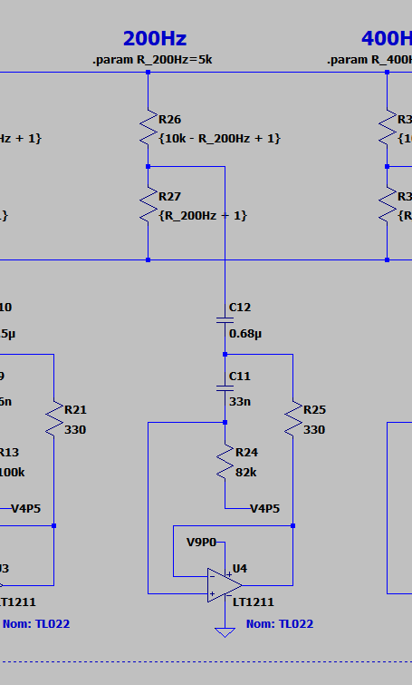
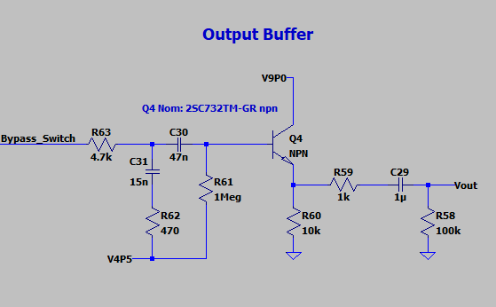

I find myself with a bit of excess time on my hands, now that I'm between jobs. Given that, I've found a few more challenging pedals to tear into and analyze. 

First of these: the Boss GE-7 graphic equalizer pedal. This is a real standard, no-frills EQ pedal, and a real common selection among guitarists.

If you haven't had a chance to look at the writeups for other pedals I've analyzed, those are available here:

<ul>
    
    <li>
    	<a href="{{ post.url }}">{{ post.title }}</a>
    </li>
    
</ul>

***Also!*** I'd love to help analyze a particular pedal you're interested in learning about. Got a particular effect you know and love? Send me a schematic and I'll see what I can do. 

​    

# Schematics

If you'd like to follow along at home, the LTSpice schematic, as per usual, is [up on GitHub](https://github.com/Cushychicken/ltspice-guitar-pedals). This time, I'd recommend you pull down a copy. This design is too big to show the whole thing in detail in one picture! 

# Input Stage

The GE-7 input stage is a AC coupled noninverting amplifier, set for 10x gain, and biased to a 4.5V operating point through R49. This bias is maintained at AC through C24 coupling to the 4.5V bias rail. Introduces a Zero into the circuit near 2.2kHz - high frequencies are *greatly* amplified

**Note:**  The input amp here is nominally a Hitachi preamp circuit optimized for low input noise. I'm substituting an LT1211 here, as the precise part it's not essential for understanding circuit function. I had suspected that maybe the HA1457W was a better performer on some audio parameter - THD, or perhaps input noise - but inspection of the datasheet shows that's simply not the case. Even with a 12.5 [nV/rtHz] noise rating, the LT1211 measures out to an input voltage noise of 7.8 uVrms across a 2Hz - 22kHz bandwidth. On its worst day, even accounting for gain, that would still whip the HA1457W's *typical* noise rating of 53uV. 

I'd be curious to understand how this pedal measures out at -100dB A-weighted noise, but that's a task for another day - one where I've got an AP and a spare EQ pedal handy. 

# Volume Level

**Note:** I'm substituting the LT1211 here as a stand-in for the nominal uRC4558. I've done this before in the TS808 model with some success - the opamp isn't doing anything special besides providing a high impedance input/low impedance output for subsequent stages. 

The level sweep is controlled by a low-corner RC filter (R3 + C2 with fc = 7.2Hz) connected to the center wiper of a potentiometer. Short the wiper to the Vol_Input node, and that lowpass filter shunts most of the energy at Vol_Input to GND. 

Short the wiper in the opposite direction to the inverting opamp node, and something interesting happens. At signal frequencies (i.e. above 7.2Hz), the opamp starts to see a 5:1 divider formed by R54 and R3. The result of this is a ~15dB boost at the Vol_Level output. 

Without this potentiometer, the GE-7 volume level stage is a pretty standard unity gain buffer. With the added RC filter on the potentiometer tap, however, it's a cheap and easily controllable level stage. 

# Equalizer Bank

## Equalizer Summing Amp

The equalizer stage starts with a relatively simple summing amplifier...

## Equalizer Bank

...but branches out rapidly into a rather large bank of Sallen-Key filters.

We'll zoom into the first of these Sallen-Key filters so we're not trying to read from high altitude. 

A slightly less academic term for this topology of Sallen-Key filter is a *gyrator*. Gyrators are opamp circuits that simulate inductors. The following diagram is a really simple first-pass approximation of what this looks like. (I got lazy and didn't connect the opamp rails. Sue me.)

You'll note that this RLC circuit forms a convenient little second-order bandpass filter. Adding another resistor to the input inverts this behavior, making it a *bandstop* or *notch filter.*

Having taken that little detour into gyrators, we can apply what we know about this gyrator circuit with what we know about a linear pot shorting two terminals in an opamp buffer. 

The connection to the linear potentiometer is easier to see with a little redraw, and some annotations. Look familiar?

The idea here is that this is *basically the same circuit* as the input volume control. You're just changing out the volume level's first order RC wiper for the equalizer's second order RLC wiper. 

As a result, you get approximately the same behavior:

- Short the gyrator RLC to Eq_Input, and you cut that frequency bank by ~15dB
- Short the gyrator RLC to Eq_Feedback, and you boost that frequency bank by ~15dB

The steps above show the possible frequency cuts or boosts for the 100Hz EQ bank. The behavior is essentially the same for all of the other filter banks - they are just shifted in frequency to the center of the RLC circuit. 

A valid question after all of this simulation rigamarole: why bother? Why not just get a regular old inductor instead of dealing with all of this gyrator nonsense? 

It's a good question. It wouldn't be done this way unless there was a good reason to do so. Let's look at the 200Hz gyrator notch for our answer:

The equivalent inductance here, from our earlier equation, is:

$$
L = R_{1} * R_{2} * C_{2} = 82[k\Omega ]*330[\Omega]*33[nF] = 0.89 [H]
$$

An inductor rated to 0.89 Henries is a *huge* inductor, both in value and in physical size. Take, for example, the common mode chokes in any given AC/DC power supply. These are *big* inductors, typically rated in the tens of millihenries, and will easily occupy a 2 centimeter cube. I couldn't even begin to estimate they physical size of an inductor that's rated an order of magnitude higher than these. (I'll leave that as an exercise to you, the reader, to find on DigiKey.) 

In any case, a 2 cubic centimeter part is not gonna fly in an effects pedal. Remember - there are six of these circuits in the GE-7, which has an enclosure size of 13 cm by 7 cm by 5.5cm. I'd be surprised if you could get six inductors that size in the *box* - and, since we're looking at the 200Hz notch, that's not even the biggest inductor value in the design! 

Besides size, you have to remember tolerance values. It's hard to source big inductors with tighter tolerances than 20%. On the other hand, it's easy (and cheap) to source 1% resistors and 5-10% capacitors. Correspondingly, it's way easier to use those tighter-tolerance parts to yield a tighter-tolerance notch.

I'd also wager that, on net, it's way cheaper to design with gyrators than with inductors. Chip vendors typically give price breaks at roughly logarithmic volumes. Thus, the faster you can buy 1k, 5k, or 10k pieces of a given silicon device, the cheaper your per-unit design becomes. That gets way easier when you're buying multiple components per assembly. By using three dual TL022 opamps per design, it's easier to get a scalable cost savings in your pedal designs. You only need to build ~350 GE-7s to achieve a cost savings from 1k volume pricing of TL022s. You'd likely need to sell a thousand pedals to get a price break from a similar inductor vendor - provided, of course, that those inductor vendors give pricing breaks at 1k volumes!

# Bypass Switching

The bypass circuitry is a common design from Ibanez and Boss effects pedals. 

## JFET Swithces

A pair of JFETs AC coupled to the outputs of U2 (equalizer output) and U9 (the dry input signal) form the switch bank that determines whether the pedal output is Equalizer, or simply Bypass. 

One channel is activated at a time by pulling either Effect_Gate or Bypass_Gate to GND. That shorts the corresponding output Bypass_Switch, and sends the audio signal to the output stage.

Full disclosure: I typically cut out J2 and short Effect_Out to Bypass_Switch for the purposes of simulation. The reason? I'm lazy, and I haven't taken the time to figure out a way to automatically disable the control circuitry in LTSpice when the sim starts up. I'd love to know a method for this if you have a trick up your sleeve. 

## Bistable Switch

This is the control for JFETs J2/J3. 

It's designed so that a specific startup sequence occurs when power is applied to the pedal:

- The base of Q1 is pulled up to V9P0 thru D1. This turns on Q1, pulling Effect_Gate low and shuts off J2.
- Q1 turning on, in turn, pulls down the base of Q2. This shuts off Q2, pulling Bypass_Gate high. 

All this means is that, when power is applied, the pedal naturally comes up in Bypass mode. You have to trigger the switch to turn the equalizer on. 

Full disclosure: I don't know a great way to have this trigger Sw_Activate in the simulation startup. Like I said in the previous section, I typically cut out the JFETs when simulating. I'd love to spend a little time analyzing the click/pop of that circuit switchover once I figure out a good way to do so. 

# Output Buffer

The output buffer is a bog-standard AC coupled emitter follower, of the kind we've come to know and love. R63 + C31 + R62 form a lowpass filter with fc = 2.2kHz. This forms a pole that compensates the zero at 2.2kHz from the input stage, flattening the pedal's frequency response above 2.2kHz.

# Acknowledgements

The [Hobby Hour Schematics page](https://www.hobby-hour.com/electronics/s/ge7-equalizer.php) has a big list of effects pedals that I've been sourcing schematics from. I used that page as a reference for this schematic design and its component part numbers.

I also had a look in my copy of Douglas Self's *Small Signal Audio Design* for a good explanation of graphic EQ circuits. If you've got a copy laying around, it's on pages 447-450 of the Second Edition. 

If you don't have a copy of Self's book, you can always have a look at Rod Elliot's page on [active filters using gyrators](https://sound-au.com/articles/gyrator-filters.htm). It's an epic and thorough read on the topic. 

Further reference for AC coupling Sallen Key filters (a.k.a. gyrators) was taken from TI's app note, [More Filter Design on a Budget](http://www.ti.com/lit/an/sloa096/sloa096.pdf). A handy reference for the cheapskate audio hobbyist, along with [its predecessor](https://nanopdf.com/download/filter-design-on-a-budget_pdf) (served here by NanoPDF, as apparently the original was taken down by TI).  

The Geofex forum also has a great description of [the dry/effect chain switching in Ibanez and Boss pedals](http://www.geofex.com/Article_Folders/bosstech.pdf). Have a read! 

I'd also like to call out [Michael Bean](http://michaelbeanmusic.com/), Boston-area multi-instrumental genius, for what I think is the coolest use of a Boss GE-7 I've ever seen. He uses a Boss GE-7 and a Wurlitzer emulator to make a pedal steel sound like a Hammond organ. The GE-7 serves the same function as the organ valves. Unbelievably cool in execution, especially when you add in the pedal steel bends. I truly don't know how that guy can operate all that machinery at once - pedal steel, bar, volume pedal, and GE-7. Go see him once it's safe to see live music again!
