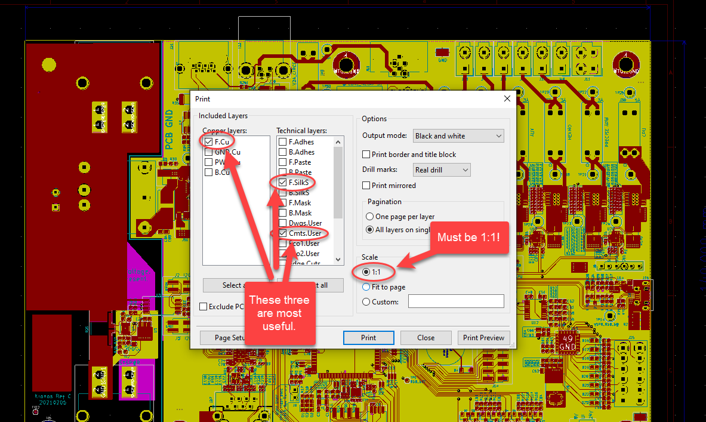
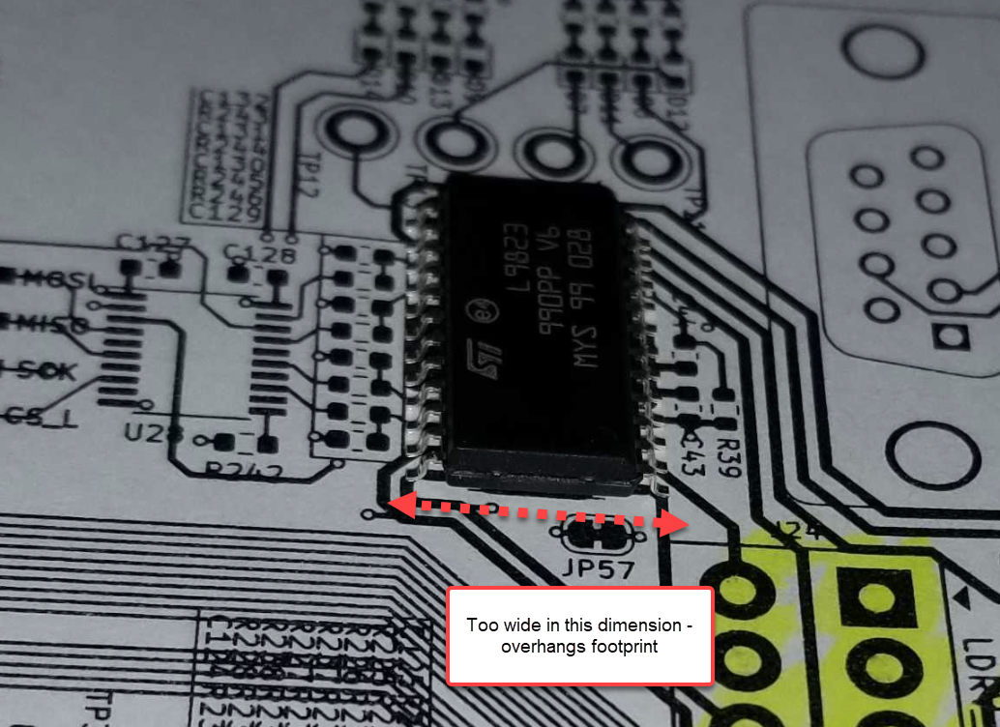

A useful trick taught to me by Florin Cocos (aka @voltlog) is to print out a sheet of paper set with new board footprints, and verify that your components fit their printed footprints, before ordering PCBs.

This is a great trick. I’ve only done it a handful of times so far, and it’s already saved me thousands of dollars in PCB fabrication errors. 

To do this in KiCAD, you need simply open your PCB file using Pcbnew, click "Print" in the toolbar, and make the following selections in the dialogue:

This will give you:

- The top side copper layer with your footprints’ actual landing pads, 
- The top side silkscreen layer that surrounds your footprints, and
- The board comments layer. It’s really useful to have some sort of dimensional callout on your PCB in this layer so that you can use a ruler to verify that your scaling is set correctly once you’ve printed. 

Note that it’s absolutely critical to select the "1:1" option - this ensures that the printout will be the same size as the actual footprints.

Once you have this option set, print!

In tandem with this printout, you will also need to order a set of sample components from Mouser/Digikey/whoever your preferred distributor is, and align these components to the printed footprints to test for correct sizing.

It is not perfect at catching all errors. This will not, for example, help you catch symbols or footprints with incorrect pinouts. It will, however, help you catch gross errors in part geometry, or instances where you are using an incorrect package size. Here's an example of a component that was found to be wider than its footprint using this method:

All credit to Florin for this great trick. Check out his videos [on YouTube](https://www.youtube.com/channel/UCdXHgsCiql_78oT5ydXWvzA)!