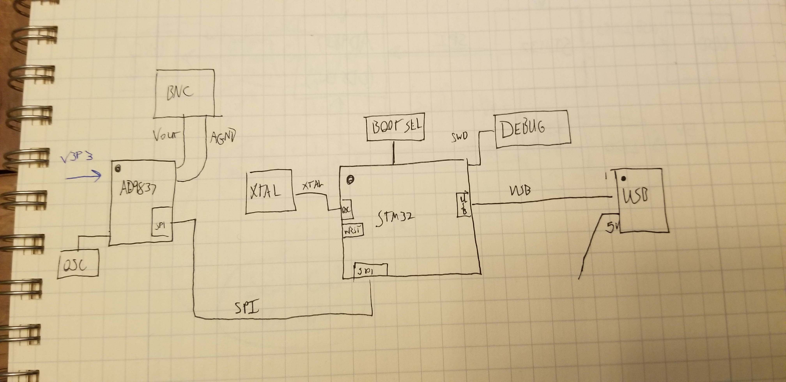
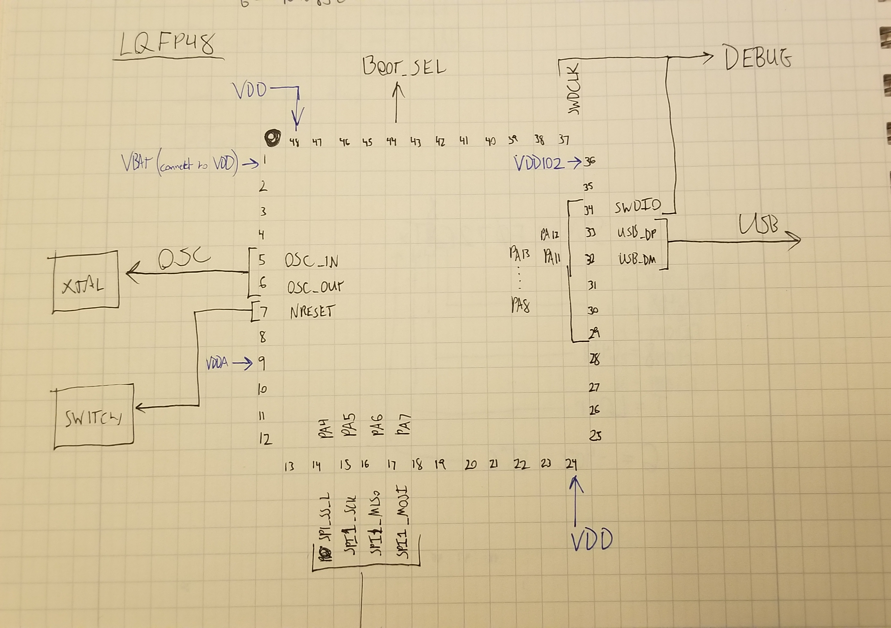

Whenever I’ve needed to spin a circuit board these last few years, I’ve taken a bit of time early on in the process to make a placement diagram. I don’t know if this is an industry standard thing that I’ve just never heard of before, but seeing as I’ve never heard of it, I’d like to take this opportunity to coin the term “placement diagram". A placement diagram is nothing special: it’s a block diagram, where each block represents a chip in a circuit layout, with sub blocks representing pin groupings on each chip. Lines drawn between each pin grouping represents IO connections, or buses between chips. The idea is to have a really simple representation of where each set of pins (power, data buses, DAC/ADC pins) breaks out on the chips in your layout, so you can plan for arranging them on a printed circuit board. This need not be super time consuming. For a simple two or four layer design, I can whip one out in an hour. For a larger board with multiple ICs, voltage regulators, and a higher layer count, it's probably the work of a day.

Here’s an example of how I did this for [bFunc, the function generator I spent a few weeks designing last year](https://github.com/Cushychicken/bfunc):

You can see that each chip has its own block, and that each IC has spots labeled representing pin groupings that connect to other components - in this case, things like SPI, USB, and other chip functions like oscillators and boot selection strappings. The idea is to make a diagram of connections that take up meaningful space on your circuit board, so you can see where each chip and connector lives, and how they interconnect with one another. 

You can - and in many cases, should - get even more detailed with these. Here’s the precursor sketch I did for the LQFP package of the STM32 chip I used for bFunc:

This is a relatively simple example, but these diagrams generalize nicely to larger and more complex systems. I’ve used placement diagrams to plan IC breakouts on six and eight layer boards with DRAM, PCIe, Ethernet, and HDMI routings. They really shine when you’re trying to plan for connector locations on a board. 

A placement diagram is also a nice piece of collateral to help you talk intelligently about tradeoffs with your cross functional peers. This is super helpful in the early stages of any product design. The MEs, the RF folks, and the industrial designers are all going to be antsy about where components and connectors live in the product - each for their own reasons. A placement diagram is an easy, non-technical, non-threatening way to show all these people: “Look! This is where these parts of the chips live, and this is how we can interconnect them in a way that invites minimal risk.” It’s a lot easier to use that as a starting point to spitball about alternatives than a circuit board layout. (What can I say - a layout suite just doesn’t have the magical, “flying through space” vibe that a 3D CAD package does.) It’s also a great way to keep your PCB designer happy. Doing a little leg work to simplify their life gives them more time to get critical details like skew compensation and diff pair matching right. 

Why bother all of this? The short answer: there’s a missing link in modern EE CAD suites between schematic capture programs and PCB design software. Schematics naturally encourage a design that preferences for intellectual comprehension over physical, geometric constraints in semiconductor packaging. PCB editors, on the other hand, are all about rigid reality. There’s no getting around the pin placement a chip vendor has selected on their packaging. On top of this, it’s pretty rare that an IC vendor bothers to give you any input on integrating their chip into your system beyond a reference design. (Some vendors don’t even extend *that* courtesy!) System integration and design is squarely the responsibility of you, the designer. Multiply this by the number of chips you have in your design, and it’s plain to see that you need a plan to run with!

Placement diagrams have been great at filling that niche for me. I’d love to know any other tricks you might have for planning your circuit board layouts. 