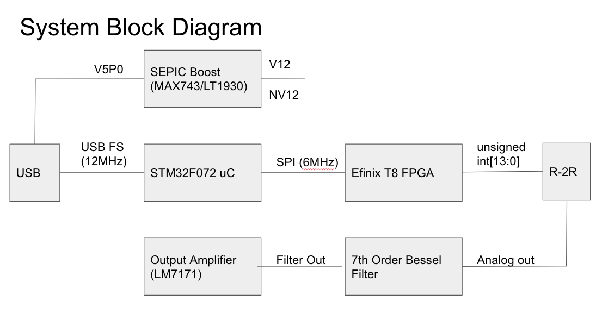

I spent a few weeks last year working on bFunc, a design I made for an open source function generator. I’ve considered making a second version that fixes some of the original issues, adds features, and generally makes it a more complete product, but I don’t think I will. Having done this once already and fallen on my face a bit, I’ve come to realize that the business incentives in the Engineering Test Equipment space are kind of stacked against me. 

This is my postmortem on the business of running bFunc v1, and, I suppose, the “pre-mortem” on bFunc v2, which I’ve sort of decided to let die on the vine. 

# How did v1 do as a product? 

Truth be told: better than I expected. I sold 15 boards, for a gross revenue of about $600. This left me with net earnings of about -$674USD. Translation: I spent about $1300 to make these boards, and I got about $600 back, for a net expenditure of just under $700 on my part. 

# Why didn’t it do better? 

Three main reasons. 

## Reason 1: Unit Economics 

Making small runs of electronics is _expensive_. Because of the time constraints I set myself, I paid for expedited fabrication through CircuitHub. If I’d planned better, and had the idea to do this build sooner, I probably would have ended up paying about $600 for my run of ten boards. I also profited from a fab error that caused CircuitHub to send me a second run of boards after I discovered the issue, so I basically got 2x builds for the price of one.

In any case, the unit cost for one bFunc board ended up being around $170 per piece. Yikes. Totally unbearable from a market standpoint. 

Speaking of which: what price _will_ the market bear for bFunc? I only have anecdotal data here. I sold a good number of them at $40 a pop, even thought that was a pretty significant loss for me on a per-unit basis. I sold a few more at increased Gumroad pricing for about $75 as well. Still a loss, but a much lower one. I’ll say, for convenience, that the market will bear a $60-$75 price point for a bFunc board. That makes a lot of sense to me as it doesn’t offer a whole lot of added functionality over any given MCU board plus a SparkFun MiniGen board, which would run in a comparable price range.

Given that target price range, we can easily back out the COGS limit of the board. Most common sense limits on pricing suggest you want to set COGS to be a fifth of your sale price. Thus, we can divide our sale price range by 5 to get our COGS range, leaving us with a COGS limit of $12-15. 

To reach that unit pricing, I’d have to buy about 500 pieces from either PCBWay or CircuitHub, for a total expenditure of $5500 - $7500. This is kind of a lot of money for one person. For a small business, it’s not! In fact, I'd say this is *very* reasonable pricing for a small manufacturing run. The breakeven point would mean selling only a fifth of the boards, or about 100 units.  

That’s actually not the worst risk profile I’ve seen for a project of this kind. So, why not go for it? 

My answers are more driven by business than technology.

## Reason 2: Marketing

When I was trying to get people to buy bFunc, I was blogging about it nearly every day, and posting weekly progress updates on development. This made a few people very happy, and also led a number of people on /r/electronics to call me a self-promoting spammer. When you consider the time investment involved, and the emotional lift of dealing with people being shitty on the internet, it was a _lot_ of work. However, all this blogging, posting, and talking to people _did_ get results. I sold a board every two or three days! 

At a certain point last year, though, I started to lose steam. My blog updates became less frequent. My motivation dropped. COVID hit. Shit just sort of globally went off a cliff. And sales ended up going off the cliff with them. 

This experience taught me two things about marketing:

- **Marketing Lesson One:** As soon as you stop talking about your thing, people stop buying it. Sales tanked a week after my last blog post about it. I have yet to sell a board since. 
- **Marketing Lesson Two:** Reaching critical mass around your product - getting to the point where people talk about your product organically, without you seeding the conversation - is really, _really_ hard, and takes a long time. Way longer than the two months I spent talking about bFunc, that’s for sure. This project gave me an immense amount of respect for folks like Chris Gammell, Thea Flowers, and Jack Ganssle, all of whom have built _really_ robust online communities around their products, or as ancillary networks to their consulting businesses. 

Marketing: it’s harder than this engineer properly realized. Consider me humbled by this experience. I have not bitched about marketing people since, and I likely never will again. 

## Reason 3: Market Positioning

This is the work I should’ve done _before_ I set out to try and monetize this project. Doing it in hindsight gave me a lot more ideas of where the opportunity is. The question I didn’t ask up front, but should have, was: what are other competitive products in the marketplace doing, and at what price point? 

| **Parameter**     | **bFunc 1.0**  | **Feeltech FY6900-20M**            | **Siglent SDG830**                             | **Tek AFG1022**                        |
| ----------------- | -------------- | ---------------------------------- | ---------------------------------------------- | -------------------------------------- |
| Sine Bandwidth    | 1MHz           | 20MHz                              | 30MHz                                          | 25MHz                                  |
| SFDR              | Unknown        | ≥50dBc(<1MHz); ≥45dBc(<20MHz)      | >60dBc (<1MHz) >55dBc (<10MHz) >50dBc (<30MHz) | -50dBc (<25MHz)                        |
| Amplitude (pk-pk) | 0.6[V] (fixed) | 0.001-24V (<5MHz) 0.001-5V(>20MHz) | 0.002-10 [V] (50Ω) 0.002-20 [V] (hi-z)         | 0.001-10 [V] (50Ω) 0.002-20 [V] (hi-z) |
| DC Offset         | 0.3[V] (fixed) | +/-12V (<20MHz)+/-2.5V (>20MHz)    | +/-5V (50 ohms) +/-10V (hi-Z)                  | +/-5V (50 ohms) +/-10V (hi-Z)          |
| Price             | $75 USD        | $84 USD                            | $269 USD                                       | $948 USD                               |

It's pretty obvious at a glance that bFunc rev1.0 wasn't exactly a stiff competitor to other stuff out there. In fact, even calling it a "competitor" on technical merit was a long shot. 

# What could version 2 look like?

I sketched out the following design on a napkin (or, rather, draw.io, the digital equivalent of a napkin) for a very preliminary look at a bFunc Rev2.0 design: 

This addresses a few glaring issues with the first version:

* Much wider bandwidth
* Digitally adjustable DC offset and amplitude, via scaling within the FPGA
* Better noise rejection and antialiasing
* Better square wave performance 

Here are the rough specs I came up with based upon what I think I’m capable of delivering, technology wise, in version 2:

- Bandwidth
  - Sine: 25MHz
  - Square: 5MHz
  - Triangle: 5MHz
- Spur Free Dynamic Range (SFDR):
  - Sine: -50dBc, to 5MHz
  - Sine: -40dBc, to 25MHz
- DC Offset:
  - +/-2[V] into 50[Ω] Load
  - +/-10[V] into open circuit/high Z load
- Output Amplitude
  - Open Circuit/High Z Load: +/-10[V] to 5MHz
  - 50[Ω] Load: +/-2[V] to 5MHz

And here’s how those specs compare to a few other similar function generators on the market. 

| **Parameter**     | **bFunc 2.0**                    | **Feeltech FY6900-20M**            | **Siglent SDG830**                           | **Tek AFG1022**                       |
| ----------------- | -------------------------------- | ---------------------------------- | -------------------------------------------- | ------------------------------------- |
| Sine Bandwidth    | 25MHz                            | 20MHz                              | 30MHz                                        | 25MHz                                 |
| SFDR              | >50dBc (<5MHz)>40dBc (<25MHz)    | ≥50dBc(<1MHz); ≥45dBc(<20MHz)      | >60dBc (<1MHz)>55dBc (<10MHz)>50dBc (<30MHz) | -50dBc (<25MHz)                       |
| Amplitude (pk-pk) | 0.005-4V (50Ω)0.005-20V (hi-z)   | 0.001-24V (<5MHz) 0.001-5V(>20MHz) | 0.002-10 [V] (50Ω)0.002-20 [V] (hi-z)        | 0.001-10 [V] (50Ω)0.002-20 [V] (hi-z) |
| DC Offset         | +/-2[V] (50 ohm) +/-10[V] (hi-z) | +/-12V (<20MHz) +/-2.5V (>20MHz)   | +/-5V (50 ohms) +/-10V (hi-Z)                | +/-5V (50 ohms) +/-10V (hi-Z)         |
| Price             | $ ??? USD                        | $84 USD                            | $269 USD                                     | $948 USD                              |

This comparison tells me, quite plainly, that there’s not a lot of room to compete at the bottom end of this market. Koolertron has the low end of this market sewn up at about $100 and under, with a very nice, full-featured product that features onboard UI, two channels of output, and a really nice plastic enclosure. There is no way I can compete with this. I’m up against what appears to be an Asian contract manufacturer that has an on-site engineering staff, supply chain connections, equipment to produce huge volumes at scale, and enough web presence to sell on Amazon. 

Siglent, too, is probably a tough sell to compete against. Siglent is a great company. I've liked using every tool of theirs I’ve tried. I haven’t used their function generator yet, but I’m sure it’s a great piece of kit. They also have some industry connections that make for some nice synergies in their product development capabilities. I have it from reasonably reputable sources that Rohde and Schwartz has their test equipment firmware for Siglent to use. 

I know I can compete with Tek or Keysight on price. I know I _can’t_ compete with them on features or technology. They are providing solutions to 5G developers and electronic warfare engineers, who require bonkers signal generation capabilities. That’s way beyond any of my humble, home-lab engineering capacity.  

# Where do we go from here? 

The most fertile opportunity, to my eye, lies between the Siglent tier and the Tek/Keysight tier. A product that could hit a $350 price point, with a $70-75 COGS, could stand a chance of being both competitive and profitable when compared to top end test brands, and more value driven US/Asia collaborations like Siglent. 

The big remaining question, then, is: How? 

I see two possible areas of differentiation:

- Portability
- User Interface

Why these?

There is demand in the electrical engineering world for more small, portable, high quality test and measurement tools. This doesn’t seem intuitive at first glance. Search “USB oscilloscope” on any given EE forum, and you’ll learn quickly that many EEs harbor deep suspicion for these types of products. There are many out there who don’t trust equipment without “Tek” or another major name brand on the front. Hell, there are some old school folks who don’t trust anything without “Hewlitt-Packard” on the front - and HP hasn’t made test equipment in _decades!_ However, I see one really compelling counterpoint to this. The Saleae series of logic analyzers are a capital example of how, in spite of pretty widespread doubt, a high quality portable EE tool can succeed. TotalPhase, while slightly less popular, also represents a company that's built a strong brand around portable, useful gadgets for embedded systems developers. 

From my perspective, UI is a big component of Saleae’s success. Their desktop app, Logic, just went through a _huge_ redesign, and it's even more polished and refined than it was to begin with. It makes acquiring, decoding, and analyzing digital protocols a breeze. This is in sharp contrast to function generators. My research shows that there really only two kinds of UI for function generators: potentiometers with knobs, and digital keypads and buttons. This makes sense, and mirrors the fundamental technical changeover from pure analog function generators to digital methods like direct digital synthesis. 

I do wonder, though, whether there are marginal gains to be had from improved UI. Saleae comes in handy when you’re doing embedded development work - trying to get a chip up and running, or validating a data transfer between an outboard I2C device and an MCU, or reading out raw SPI flash captures are all a breeze with a Saleae. All of these tasks involve a degree of rinse-and-repeat work, where you're trying new combinations of data and looking to see thaty you get the effects you expect on the bus, and also in software. A nice UI adds a lot of value here by being easy to use and reconfigure. Function generators don’t have a similar kind of use case. Typically, you use a function generator to set a single kind of waveform you need, inject said waveform into a circuit, and then measure the output of the circuit under test. That’s generally a quick process, and requires you to actually use the function generator for about 10 minutes. That covers, in my estimation, 90% of function generator use cases. If that’s the case, then I expect there aren’t a lot of marginal gains to be had by improving the UI. 

I still stand by my fundamental assertion here: nobody has made the Saleae of function generators yet. 

The essential unanswered question is: does it need to be?