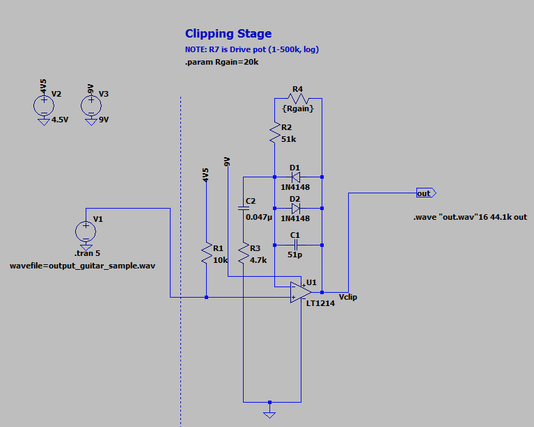

I've had a lot of fun over the past few years using LTSpice to analyze guitar effects pedals. One request that's come in with relative frequency has been: "Can you use an MP3 or WAV file as an input to the simulation to see how the pedal would sound?" 

I've never taken the time to figure this out, but fortunately, a nice email from Jeroen van Dongen got me off my duff. Jeroen sent along this very nice link from someone at CERN who figured this out already: 

https://vmascagn.web.cern.ch/LABO_2020/LTspice_and_wav_files.html

Helpfully, it also shows how you can save the *output* to a WAV file as well, making it easy to import to Python/Jupyter for further analysis. Nice!

Jeroen's already getting busy using the [Tube Screamer LTSpice sim](https://cushychicken.github.io/posts/ltspice-tube-screamer/) I made a few years ago to test this out:

Very cool. I will definitely be putzing around with this more soon.

If you haven't had a chance to look at the writeups for guitar pedals I've analyzed, those are available here:

<ul>
    
    <li>
    	<a href="{{ post.url }}">{{ post.title }}</a>
    </li>
    
</ul>

