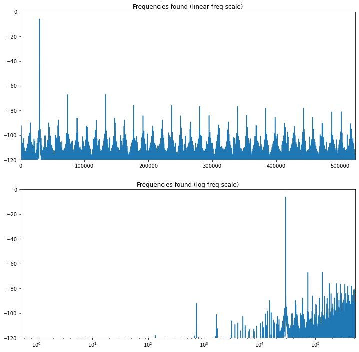

I can't seem to crack my obsession with Direct Digital Synthesis. I had to learn rather a lot about it as part of working on [bFunc](https://cushychicken.github.io/bfunc-design-doc/) last year. Even though [I've sort of decided to not build a second version of bFunc](https://cushychicken.github.io/bfunc-v2-postmortem/), I still find the concept of digital frequency synthesis really interesting. It's a fun little mix of analog and digital signal processing. So, with that, I decided: why not try and build my own direct digital synthesis engine? I've got nothing but time on my hands, a Jupyter notebook, and an open source VHDL compiler. You can find [my efforts thus far on GitHub](https://github.com/Cushychicken/dds-engine).

If you'd like to grab this post as a Jupyter notebook to putz around with, you can find it in the `tools/` folder of the repo above. It's called `dds-model-basic-engine.ipynb`.

```python
import pandas as pd
import numpy as np
import scipy as sp
import math
import matplotlib.pyplot as plt

%matplotlib inline
```


The first step of the analysis is to make some assumptions about the DDS engine we'll be working with here. I'm setting a stretch goal of a 100MHz clock frequency/sample rate for the DDS, and an accumulator depth of 32 bits. 

That gives us a frequency resolution of:

$$F_{res} = \frac{F_{clock}}{2^{N}} = \frac{100 MHz}{2^{32}} = ~0.02 Hz$$

To save some brain sweat, I'm going to write two quick functions to interchange frequencies and tuning words:


```python
# Returns the frequency tuning word for a desired frequency output 
# Default: 
#    - Sample rate/input clock = 100MHz
#    - Phase Accumulator depth = 32 bits
def freq_to_tuning(freq_out, sample_rate=100000000, acc_depth=32):
    return int((freq_out * (2**acc_depth))/sample_rate)

# Returns the frequency output for a given frequency tuning word
# Default: 
#    - Sample rate/input clock = 100MHz
#    - Phase Accumulator depth = 32 bits
def tuning_to_freq(tuning_word, sample_rate=100000000, acc_depth=32):
    return (tuning_word * sample_rate) / float(2 ** acc_depth)
```

Note, too, that these aren't perfect exchanges. There's some quantization error inherent in a digital system - that's the frequency resolution we calculated a second ago. You can see this by just jumping back and forth between formats, and noting the error between the conversions:


```python
freq = 2822400
tuning = freq_to_tuning(freq)
freq_actual = tuning_to_freq(tuning)

error = ((freq_actual - freq)/freq) * 100
print(f"{freq} Hz signal: {tuning:#010x}")
print(f"{freq_actual} Hz signal: {tuning:#010x} ({error})")
```

    2822400 Hz signal: 0x0739b024
    2822399.977594614 Hz signal: 0x0739b024 (-7.938416231246222e-07)


There's also error introduced in the way that Python truncates rather than rounds when converting between `float` and `int`. Astute readers have likely noted that the _next_ value, `0x0739b025`, actually produces a lower-error signal. Tuning code `0x0739b025` produces an output of 2822400.0008776784 Hz rather than the original 2822399.977594614 Hz: 


```python
tuning = tuning + 1
freq_actual = tuning_to_freq(tuning)
error = ((freq_actual - freq)/freq) * 100
print(f"{freq_actual} Hz signal: {tuning:#010x}")
print(f"{freq_actual} Hz signal: {tuning:#010x} ({error})")
```

    2822400.0008776784 Hz signal: 0x0739b025
    2822400.0008776784 Hz signal: 0x0739b025 (3.109688188483656e-08)


Worth noting: a typical uncompensated quartz crystal will vary around 25-50ppm in frequency when installed into an oscillator circuit. Whether or not this is something you need to lose sleep over is specific to your application. Odds are this is a totally appropriate amount of jitter for your frequency synthesis application. (If it's not, then you're probably working on something like an atomic clock. If you _are_ working on an atomic clock, and you're reading this page for advice on timing jitter, you've got bigger problems on your plate than frequency synthesis.) Ethernet phys and Bluetooth ICs the world over happily run with oscillator reference tolerances in the 25ppm range, and reliably serve up phone calls, Spotify streams, and cat photos to people every day. 

Anywhoozles: using that rather gnarly 32 bit number `0x0739b025` as our genesis point, we can generate a sample phase accumulator output using the following code block:


```python
# Generates a phase accumulator output for a given tuning word
phase = [ 0 ]
while len(phase) < (2**20):
    phase.append(phase[-1] + tuning)

plt.plot(phase)
plt.title("DDS Output")
```


OK, great. The chart goes up, and to the right. (The business unit will be _ecstatic_.) Eventually, it's going to just roll over to zero, and keep on counting up. That's not a big deal! This is a *phase* accumulator; phase wraps around from $2\pi$ back to zero. As long as `0x00000000` corresponds to 0 degrees phase, you're in the clear! 

The phase accumulator has a couple more fortunate features for us besidse phase wrapping. At some point, we're gonna need to convert _phase_ to _amplitude_. The easiest (and also fastest) way to do this is with a lookup table, or a simple ROM. If phase wasn't a parameter that rolled over, we'd be up shit creek without an infinite memory paddle. It's also complete and absolute overkill to use all the possible addresses generated by a 32 bit phase accumulator. That'd produce a ~4GB lookup table of sine values! 

The accumulator instead gets _truncated_ down to its most significant bits - in this case, the 12 MSBs (note: dumping all of these into a pandas dataframe to keep them organized):


```python
df_phase = pd.DataFrame(zip(phase, [tuning] * len(phase)), columns=['phase', 'tuning'])
df_phase['phase_trunc'] = np.bitwise_and(df_phase['phase'], 0xFFC00000)
df_phase['phase_trunc'] = np.right_shift(df_phase['phase_trunc'], 20)
```

A short function allows us to generate sine lookup ROMs really quickly:


```python
# Generate a rom table of a sine wave with signed integers 
def generate_sin_rom(bits, rom_depth):
    # Subtract 1 from bit depth for signed data (msb is sign bit)
    amplitude = 2**(bit_depth-1)
    sin_rom = [int(amplitude * math.sin(a/rom_depth * 2 * math.pi)) for a in range(rom_depth)]
    return(sin_rom)

bit_depth = 12
rom_size = 4096
sin_rom = generate_sin_rom(bit_depth, rom_size)
```

...and a lambda function allows us to turn this into a sine wave, toot sweet.


```python
# Lambda function serves as phase-to-amplitude converter
df_phase['dds_out'] = df_phase['phase_trunc'].apply(lambda x: sin_rom[x])
df_phase['dds_out'][:200].plot()
```


    


It's a little easier to see the interrelation of these signals if you graph them together, so here's the truncated phase, the sine output, and the frequency spectrum of that output sine signal:


```python
data_fft = np.fft.fft(df_phase['dds_out'])
frequencies = np.abs(data_fft)
freq_scale = frequencies * 2 / len(frequencies)
db_freqs = freq_scale / float(2**(bit_depth))
db_freqs = (20 * np.log10(db_freqs))

# Shortening the time domain plot so sine features are visible
plot_len = 200

fig = plt.figure(figsize=(12,12))
plt.subplot(3,1,1)
plt.plot(df_phase['dds_out'][:plot_len])
plt.title("DDS Output")

plt.subplot(3,1,2)
plt.plot(df_phase['phase_trunc'][:plot_len])
plt.title("Phase Accumulator (Truncated)")

# https://dsp.stackexchange.com/questions/32076/fft-to-spectrum-in-decibel
plt.subplot(3,1,3)
ax = fig.add_subplot(3,1,3)
ax.set_ylim(-120, 0)
ax.set_yticks([-120, -100, -80, -60, -40, -20, 0])
#ax.set_yscale('symlog')
fft_ticklabels = ax.get_xticklabels()
fft_ticklines = ax.get_xticklines()

#fft_index = int(len(frequencies)/2) # Half of the FFT output 
#fft_index = 5000
#plt.plot(db_freqs[:fft_index])
plt.plot(db_freqs)


plt.title("Frequencies found")
plt.xlim(0,fft_index)
plt.show()
```


Cool! You can see how the rollover of the truncated phase bits correlates with the sine wave rolling over from $2\pi$ to 0 radians in phase. 

There are a few regular tones that you can see peeking out of the noise in the FFT above. We care about these because these determine how spectrally pure the intended output is. Hip cats in the signal processing world call this the "spur free dynamic range", or SFDR. That's the official name for the difference between your desired signal's magnitude to the magnitude of the first undesirable harmonic. This is quick to find with a few lines of Python:  sort the magnitudes of the FFT bins, and subtract the second-highest magnitude bin from the the highest-magnitude bin (a.k.a. "the carrier").


```python
len_db_freqs = int(len(db_freqs)/2)
largest_peaks = sorted(db_freqs[:len_db_freqs])[-10:]
print(largest_peaks)
sfdr = largest_peaks[-1] - largest_peaks[-2]
print()
print(f"the SFDR of this signal is {sfdr} dBc")
```

    [-60.87051887280603, -58.96907144695365, -58.928590178951204, -56.4767046085235, -56.42337932152675, -52.9676530527183, -52.888629762545236, -46.98588880831427, -46.82871924611672, -6.024467802239587]
    
    the SFDR of this signal is 40.804251443877135 dBc


This is a bit worse than the ~60dB of SFDR shown in the FFT above. Still sniffing around as to why the worst spurs don't show up as higher magnitudes on the FFT. I suspect it's some power term or squaring that I'm not accounting for. 

Plotting diffifculties aside, 40dBc (that's "decibels relative to carrier") is not really a _great_ signal to noise ratio in terms of digital synthesis. There are a few regular tones that you can see peeking out of the noise in the above FFT. Going to a log scale on the x axis (frequency axis) shows that the noise is really concentrated around the higher frequencies.


```python
fig = plt.figure(figsize=(12,12))
fft_index = int(len(frequencies)/2) # Half of the FFT output 

# https://dsp.stackexchange.com/questions/32076/fft-to-spectrum-in-decibel
plt.subplot(2,1,1)
ax = fig.add_subplot(2,1,1)
ax.set_ylim(-120, 0)
ax.set_yticks([-120, -100, -80, -60, -40, -20, 0])

plt.plot(db_freqs[:fft_index])
plt.title("Frequencies found (linear freq scale)")
plt.xlim(0,fft_index)

# https://dsp.stackexchange.com/questions/32076/fft-to-spectrum-in-decibel
plt.subplot(2,1,2)
ax = fig.add_subplot(2,1,2)
ax.set_xscale('log')
ax.set_ylim(-120, 0)
ax.set_yticks([-120, -100, -80, -60, -40, -20, 0])

plt.plot(db_freqs[:fft_index])
plt.title("Frequencies found (log freq scale)")
plt.xlim(0,fft_index)
plt.show()
```


​    


So, what can we do about all of this excess noise, and these tones degrading our SFDR? 

There's a few more neat tricks on how to get around this, including:

* Increasing the bit depth of your sin rom
* Increasing the ROM depth of your sin rom
* Dithering
* Taylor series correction

I'll dig more into each of those in good time. 

# Things I Want to Learn Next

* Improving SFDR of this signal, as I hinted previously. 
* How to model digital modulation schemes. FSK would be as simple as changing the frequency tuning word. In service of that, I'd love to learn...
* How to more elegantly generate changes in frequency tuning words.  It's programmatically trivial to generate an array of _one_ tuning word setting. I haven't figured out a nice way to do this for multiple frequency words. (Phase tuning for PSK would be a real sensible followon step, too!)
* How to better remember how to customize matplotlib charts and axes. This might be fastest to just get a cheat sheet. 

I'd encourage you to reach out to me via email ([cushychicken@gmail.com](mailto:cushychicken@gmail.com)) or on Twitter ([@cushychicken](www.twitter.com/cushychicken)) if you have a suggestion or a link for how to do any of these. Or if you just want to say hey! 

# Dope Links for Cool Cats 


## Direct Digital Synthesis

Analog Devices has long been the leader in high speed DACs and ADCs, so, naturally, they'd know something about DDS. They've even gone so far as to bundle a complete DDS solution - NCO, phase-to-amplitude conversion, and DAC - into a single DDS chip. I've used the AD9837 before in my bFunc project. There are a few big brother parts to this one that - particularly the AD9102, which is basically a whole function generator on a chip. (Thanks to John Guy from ADI for telling me that exists!) Suffice it to say, they know a lot about DDS. This is probably the single densest resource on direct digital synthesis I've found yet: [http://www.ieee.li/pdf/essay/dds.pdf](http://www.ieee.li/pdf/essay/dds.pdf ) 

Xilinx, the FPGA manufacturer, also has some great resources available to the DDS-curious. Since Xilinx focuses on higher end digital frequency synthesis applications, they get into the guts of DDS methods in a little more mathematical detail than ADI does. I really like this note's descriptions of methods to generate high SFDR waveforms.   
[https://www.xilinx.com/support/documentation/ip_documentation/dds.pdf](https://www.xilinx.com/support/documentation/ip_documentation/dds.pdf)

## Matplotlib / Plotting
Python For Engineers had a great little tutorial on plotting sine and FFT waveforms. (It also reminded me how much easier it is to twiddle graph parameters with numpy rather than pandas.) 

[https://www.pythonforengineers.com/audio-and-digital-signal-processingdsp-in-python/](https://www.pythonforengineers.com/audio-and-digital-signal-processingdsp-in-python/)

I also leaned heavily on this answer to get nice-looking FFT plots in log formats:
[https://dsp.stackexchange.com/questions/32076/fft-to-spectrum-in-decibel](https://dsp.stackexchange.com/questions/32076/fft-to-spectrum-in-decibel)

# A Request

Since you made it this far - I have two favors to ask. 

1. I'm not currently working. I'd love to keep making guides like this. My savings, however, will only last me so long. If you'd like me to keep making these guides, I'd love it if you'd buy me a Ko-Fi. Any and every little bit helps. Link here: [https://ko-fi.com/57663](https://ko-fi.com/57663)
2. If you liked this article, you can sign up for my mailing list. It'd virtually guarantee that you get more of this style of article. (And probably a few in some other styles you may not have read about.) Subscription box is directly below this!

