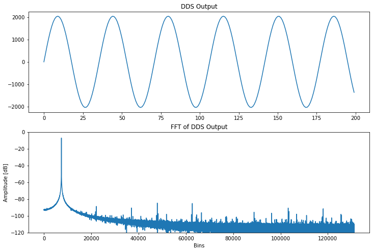
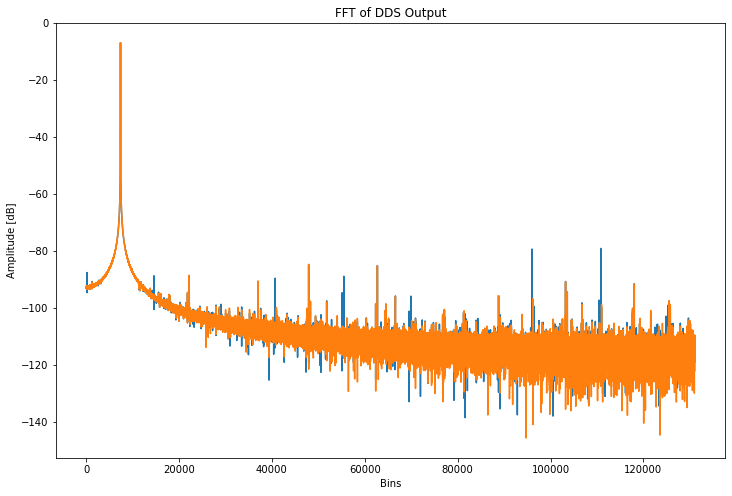
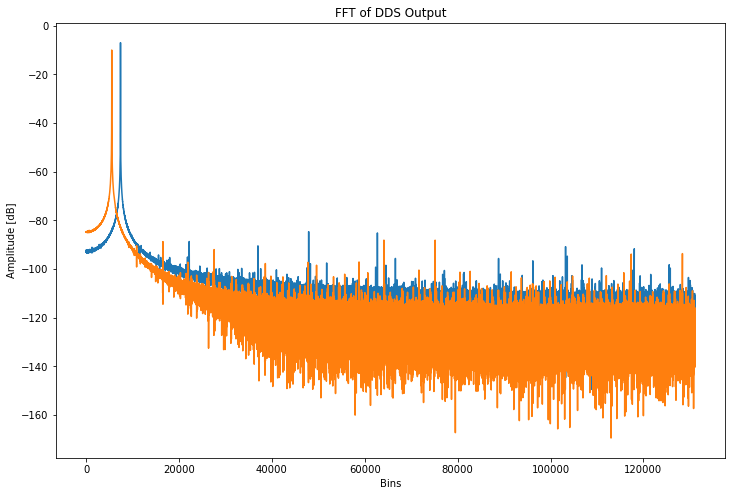

A [first pass at digital frequency synthesis](https://cushychicken.github.io/direct-digital-synthesis-python-model/) is relatively easy to pull off using some simple tricks in Python. It's not rocket science to string together a basic accumulator and a sine lookup table to make a sine wave output. However, we left off noting some spurious output in the synthesized sine wave. What can we do about that? 

Can't go anywhere until you fire up some data libraries:


```python
import pandas as pd
import numpy as np
import math
import matplotlib.pyplot as plt

from dds import DirectDigitalSynthesis

%matplotlib inline
```

I saved myself some copypasta by bundling all of my old direct digital synthesis functions into a handy class that generates the numpy arrays given a set sampling frequency, accumulator depth, ROM size, and truncation width. If you'd like to see how I did this, you can check out the raw source at: [https://github.com/Cushychicken/dds-engine/blob/main/tools/dds.py](https://github.com/Cushychicken/dds-engine/blob/main/tools/dds.py[)

...and now I wave the magic wand of functions...


```python
dds      = DirectDigitalSynthesis(100000000, 32, 4096, 12)
freq     = 2822400
tuning   = dds.freq_to_tuning(freq)
phase    = dds.generate_phase_array(tuning, (2**20))
df_phase = dds.generate_dds_frame(dither_output=True)
df_fft   = dds.generate_dds_spectrum()
```

...and receive those sweet, sweet Fourier coefficients in return:


```python
# Shortening the time domain plot so sine features are visible
plot_len = 200

fig = plt.figure(figsize=(12,8))
plt.subplot(2,1,1)
plt.plot(df_phase[:plot_len])
plt.title("DDS Output")

plt.subplot(2,1,2)
ax = fig.add_subplot(2,1,2)
ax.set_ylim(-120, 0)
ax.set_yticks([-120, -100, -80, -60, -40, -20, 0])

fft_index = int(len(df_fft)/2) # Half of the FFT output 
plt.plot(df_fft[:fft_index])
plt.title("FFT of DDS Output")
plt.xlabel('Bins')
plt.ylabel('Amplitude [dB]')
plt.show()
```




One of the options I bundled into this new `DirectDigitalSynthesis` class was the ability to dither the synthesizer's output. By default, the call to the method `generate_dds_frame()` will now add a dithering stream to the phase accumulator. 


```python
def generate_dds_frame(self, dither_output=True):
    """ Returns dds sine output from stored values in self.phase

    Keyword Arguments:
    dither_output   -- add phase dither to dds signal (default True)
    """
    # Programmatically generates mask to truncate all but most sig bits
    shift = self.acc_depth - self.bit_depth
    mask  = 2 ** self.acc_depth - 1
    mask  = mask - (2 ** (shift) - 1)

    dds_frame = np.zeros(len(self.phase))
    if dither_output:
        dither = np.random.randint(2, size=len(self.phase))
        dither = np.left_shift(dither, (shift-1))
        dds_frame = np.add(self.phase, dither)
    else:
        dds_frame = np.array(self.phase)

    dds_frame = np.bitwise_and(dds_frame, mask)
    self.phase_trunc = np.right_shift(dds_frame, shift)

    # Apply sin rom with lambda function (phase-to-amplitude)
    sin_lookup = lambda x: self.sin_rom[x]
    self.dds_out = np.array([sin_lookup(x) for x in self.phase_trunc])
    return(self.dds_out)
```

The dithering stream is a random sequence of 1's and 0's at a bit significance one less than the truncation bit depth. I.E. - if you're truncating your phase accumulator to 12 bits, then your dithered bits should be the 13th bit less than the MSB. That's the purpose of the excitement with `np.left_shift()` - it's moving the 1's and 0's created by `randint()` up to one position of significance less than the truncated phase register's LSB.

Signal wise, this dithering bitstream is just noise. However, it serves a _very_ cool purpose in a DDS application. 

Observe the following DDS example, where dithering has been turned off in the output waveform:`


```python
dds      = DirectDigitalSynthesis(100000000, 32, 4096, 12)
freq     = 2822400
tuning   = dds.freq_to_tuning(freq)
phase    = dds.generate_phase_array(tuning, (2**20))
df_phase = dds.generate_dds_frame(dither_output=False)
df_fft   = dds.generate_dds_spectrum()

# Shortening the time domain plot so sine features are visible
plot_len = 200

fig = plt.figure(figsize=(12,8))
plt.subplot(2,1,1)
plt.plot(df_phase[:plot_len])
plt.title("DDS Output")

plt.subplot(2,1,2)
ax = fig.add_subplot(2,1,2)
ax.set_ylim(-120, 0)
ax.set_yticks([-120, -100, -80, -60, -40, -20, 0])

fft_index = int(len(df_fft)/2) # Half of the FFT output 
plt.plot(df_fft[:fft_index])
plt.title("FFT of DDS Output")
plt.xlabel('Bins')
plt.ylabel('Amplitude [dB]')
plt.show()
```


    


Just by looking at the FFT, we can see a number of bins popping up through the -90dB mark. A quick list comprehension can filter out those bins by magnitude for our observation:


```python
spur_mags = [ a for a in df_fft[15000:fft_index] if a > -90]
print(spur_mags)
print("Bin Count: ", len(spur_mags))
print("Max Spur : ", max(spur_mags))
```

    [-88.77126975773648, -89.54395900838877, -84.71095967809234, -88.85702189112126, -85.11557144787643, -79.31099757967645, -88.39237953019831, -89.01214925169381, -79.09461911551446]
    Bin Count:  9
    Max Spur :  -79.09461911551446


There are nine FFT bins that pop up above this threshold. The max of these bins is just over -80dB in magnitude. 

Turn on dithering, however, and the story changes! The dithering bitstream cuts down the number of spurious frequencies by two thirds. It also improves SFDR by about 6dB!


```python
phase_dither = dds.generate_dds_frame(dither_output=True)
df_dither_fft   = dds.generate_dds_spectrum()
spur_mags = [ a for a in df_dither_fft[15000:fft_index] if a > -90]
print(spur_mags)
print("Bin Count: ", len(spur_mags))
print("Max Spur : ", max(spur_mags))
```

    [-88.51845828276828, -84.76612225469248, -85.13238321062391]
    Bin Count:  3
    Max Spur :  -84.76612225469248


So, what's going on here? Why does _adding_ noise improve SFDR? 

Since a DDS is a sampled system, it's going to contain some quantization error. You can see this error by examining the contents of the sin rom: as you get closer to the zero crossing point of the sine waveform, you'll see large quantization errors in the outputs of the ROM. A DDS operates by cycling through ROM values in a periodic fashion. This gets you a periodic waveform at the output, but it also _makes the quantization errors periodic_. These quantization errors show up in the output spectrum as spurious peaks!

A phase dither serves to make these errors _less_ periodic. An ideal dithering signal will randomly increment the phase accumulator by an additional bit. This causes a larger-than-anticipated shift in sin rom addressing, and a larger-than anticipated jump in the output of the sin rom. Do this often enough, and your quantization errors end up no longer being periodic. Dithering allows you, instead, to distribute those errors more evenly throughout the noise of the signal by interrupting the regularity with which they occur. _On average_, you're going to have fewer peaks besides your carrier tone in the output signal.

The plot below shows the undithered signal (blue) overlaid with the dithered signal (orange). Dithering isn't perfect - you can see a few places where the dithered and undithered signals overlap closely. However, the most prominent tones in the undithered signal are reduced significantly by dithering. (These are the large blue peaks on either side of bin 100000 in the plot below.)


```python
fig = plt.figure(figsize=(12,8))
fft_index = int(len(df_fft)/2) # Half of the FFT output

# First plot - undithered DDS output 
ax.set_ylim(-120, 0)
ax.set_yticks([-120, -100, -80, -60, -40, -20, 0])
fft_index = int(len(df_fft)/2) # Half of the FFT output 
plt.plot(df_fft[:fft_index])
plt.plot(df_dither_fft[:fft_index])
plt.title("FFT of DDS Output")
plt.xlabel('Bins')
plt.ylabel('Amplitude [dB]')
```


​    


# Using an Ugly Clock Rate

Clock sources like crystals and packaged oscillators generally come in nice integer values for ease of use. Values like 8MHz, 16MHz, and 25MHz are very common. However, these tend to be bad choices for DDS applications. Why? It's a radix issue. 

Every direct digital synthesizer depends on a numerically controlled oscillator to function. That's a big way of saying "an accumulator with a programmable offset". Since this is implemented digitally, the number is going to end up in hardware as a power of 2. With the exception of a few oddball values, clock crystals are generally sold off the shelf as integer values with base-10 tunings. (See earlier examples of 8MHz, 16MHz, and 25MHz.)

So, how do we get around this? Use a base-2 clock rate! 

The quickest way to demonstrate this is to modify our earlier example to run at $2^{27} [Hz]$, which, at ~134.2MHz, is the closest approximate to our original 100MHz clock rate.


```python
clock_rate = 2**27
dds      = DirectDigitalSynthesis(clock_rate, 32, 4096, 12)
freq     = 2822400
tuning   = dds.freq_to_tuning(freq)
phase_base2    = dds.generate_phase_array(tuning, (2**20))
df_phase_base2 = dds.generate_dds_frame(dither_output=False)
df_fft_base2   = dds.generate_dds_spectrum()
```

Even as an undithered signal, we can see by inspection of the FFT that the trend of the noise dips rapidly below the window of the plot. Further inspection of the spur magnitudes shows that we yield a 3dB improvement in SFDR just by modifying the clock rate! 


```python
spur_mags = [a for a in df_fft_base2[15000:fft_index] if (a > -90)]
print(spur_mags)
print("Bin Count: ", len(spur_mags))
print("Max Spur : ", max(spur_mags))
```

    [-88.79047575325237, -82.43977363516987, -81.9477432177207, -82.32848796444854, -82.06125715926972, -88.32992172649978, -88.09121615170233, -88.31348421947271, -88.10818541298289]
    Bin Count:  9
    Max Spur :  -81.9477432177207


Adding dither improves this further, to a very respectable -88dB of SFDR.


```python
df_phase_dither_base2 = dds.generate_dds_frame(dither_output=True)
df_fft_dither_base2   = dds.generate_dds_spectrum()
spur_mags = [a for a in df_fft_dither_base2[15000:fft_index] if (a > -90)]
print(spur_mags)
print("Bin Count: ", len(spur_mags))
print("Max Spur : ", max(spur_mags))
```

    [-88.71473182586095, -88.3655881988463, -88.17712305561692, -88.26839260412584, -88.23771999788298]
    Bin Count:  5
    Max Spur :  -88.17712305561692


Where do all of these improvements come from? 

It's all in the radix. Recall that the frequency resolution of a DDS system is bounded, ultimately, by two parameters: the accumulator bit depth, and the input clock frequency. 

$$\Delta f = \frac{f_{clk}}{2^{B_{\theta{(n)}}}}$$

If we choose a base-10 clock, like 100MHz, our frequency resolution ends up being $100 [MHz] / 2^{32} = ~0.023 [Hz]$.

If we choose a base-2 clock, like $2^{27} = ~134.2 [MHz]$, we see a slight degradation in frequency resolution: $0.031 [Hz]$.

...but what we lose in resolution, we make up for in decreased frequency error in tuning offset:


```python
freq = 2822400

clock_rate = 2**27
dds      = DirectDigitalSynthesis(clock_rate, 32, 4096, 12)
tuning = dds.freq_to_tuning(freq)
freq_actual = dds.tuning_to_freq(tuning)
error = ((freq_actual - freq)/freq) * 100
print("Tuning Error: Odd Clock (2^27 Hz)")
print(f"{freq_actual} Hz signal: {tuning:#010x}")
print(f"{freq_actual} Hz signal: {tuning:#010x} ({error})")
print()

clock_rate = 100000000
dds      = DirectDigitalSynthesis(clock_rate, 32, 4096, 12)
tuning = dds.freq_to_tuning(freq)
freq_actual = dds.tuning_to_freq(tuning)
error = ((freq_actual - freq)/freq) * 100
print("Tuning Error: Integer Clock (100MHz)")
print(f"{freq_actual} Hz signal: {tuning:#010x}")
print(f"{freq_actual} Hz signal: {tuning:#010x} ({error})")
```

    Tuning Error: Odd Clock (2^27 Hz)
    2822400.0 Hz signal: 0x05622000
    2822400.0 Hz signal: 0x05622000 (0.0)
    
    Tuning Error: Integer Clock (100MHz)
    2822399.977594614 Hz signal: 0x0739b024
    2822399.977594614 Hz signal: 0x0739b024 (-7.938416231246222e-07)


In practice, that gets us improved SFDR, and also a slightly lower noise floor due to decreased phase error. 

(Shoutout to reddit user /u/soupie62 for the trick of using a base-2 clock rate!) 


```python
freq = 2822400

clock_rate = 2**27
dds_base2             = DirectDigitalSynthesis(clock_rate, 32, 4096, 12)
tuning_base2          = dds_base2.freq_to_tuning(freq)
phase_base2           = dds_base2.generate_phase_array(tuning_base2, (2**20))
df_phase_dither_base2 = dds_base2.generate_dds_frame(dither_output=True)
df_fft_dither_base2   = dds_base2.generate_dds_spectrum()

dds      = DirectDigitalSynthesis(100000000, 32, 4096, 12)
tuning   = dds.freq_to_tuning(freq)
phase    = dds.generate_phase_array(tuning, (2**20))
df_phase = dds.generate_dds_frame(dither_output=True)
df_fft   = dds.generate_dds_spectrum()


fig = plt.figure(figsize=(12,8))
fft_index = int(len(df_fft)/2) # Half of the FFT output

ax.set_ylim(-120, 0)
ax.set_yticks([-120, -100, -80, -60, -40, -20, 0])
fft_index = int(len(df_fft_dither_base2)/2) # Half of the FFT output 
plt.plot(df_fft[:fft_index])
plt.plot(df_fft_dither_base2[:fft_index])

plt.title("FFT of DDS Output")
plt.xlabel('Bins')
plt.ylabel('Amplitude [dB]')
plt.show()
```

​    

# More Reading and Notes

Most of this exercise has been duplicating some output of the following Xilinx app note. 

https://www.xilinx.com/support/documentation/ip_documentation/dds.pdf

Tangentially related - I've been really enjoying reading Marc Lichtman's Python for Software Defined Radio course notes. You can find the lot of those at:

https://pysdr.org/


# Things I'd Like To Learn Next

* I'd like to spend some time next examining how bit depth affects the DDS output. 
* I'd also really love to put together a Taylor series correction model from the DDS pdf I linked prior. 
* Reddit user /u/frozenbobo gave some great input on how to isolate spurious peaks against spectral leakage of the carrier tone. I'd really like to dig into those comments and figure out a more programmatic way of isolating spurious tones in the spectrum. This analysis was all based on looking at bins 15000 and higher, and doing a peak search among those tones. 
* Still want to model some digital modulation coding schemes and analyze their spurious content. 

# A Request

If you've made it this far, I'd love you to subscribe to my email newsletter. You can get updates like this one straight to your inbox - hot, fresh signal processing takes, with no commitment on your end! 
